```{r setup, include=FALSE}
options(htmltools.dir.version = FALSE)
```


# About me 
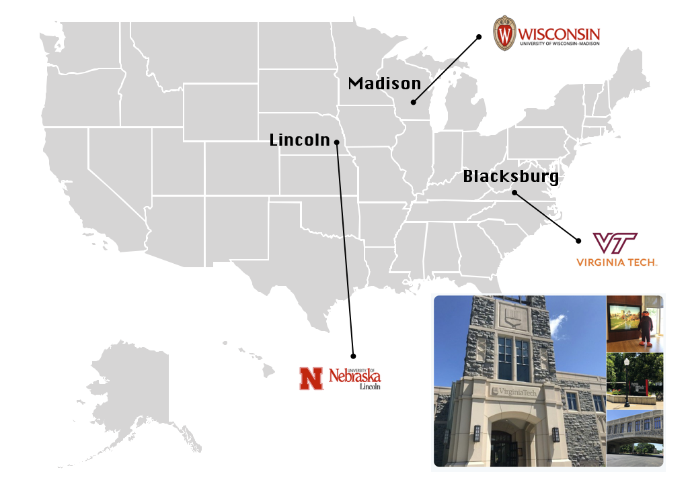


---
# IX SIGM @UFV October 2018
.pull-left[
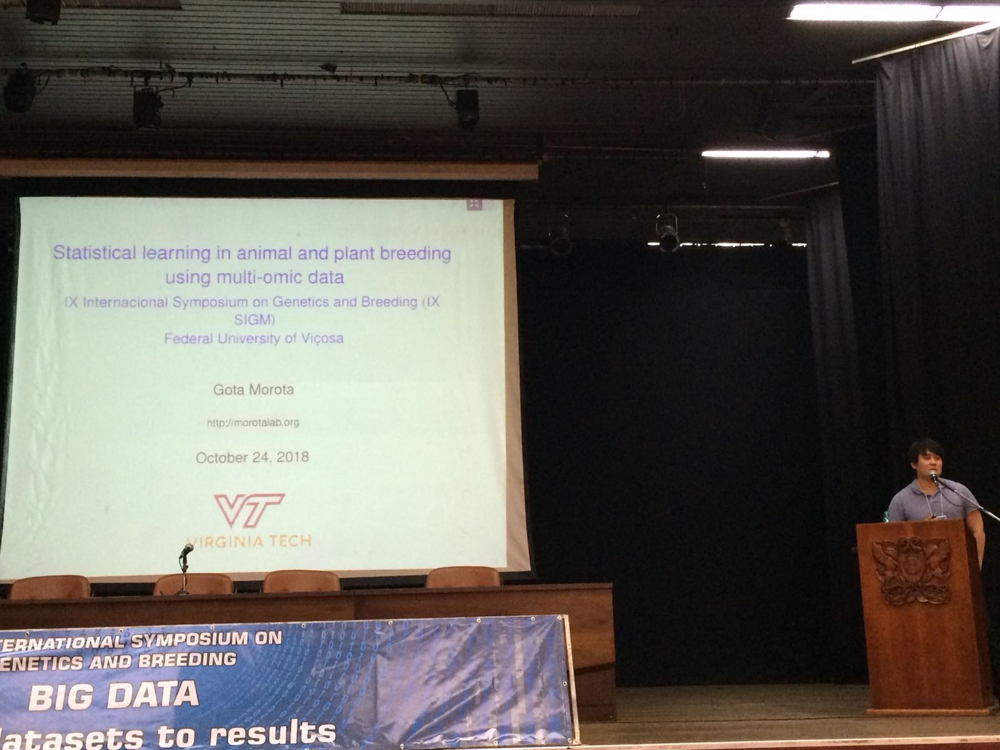
]

.pull-right[
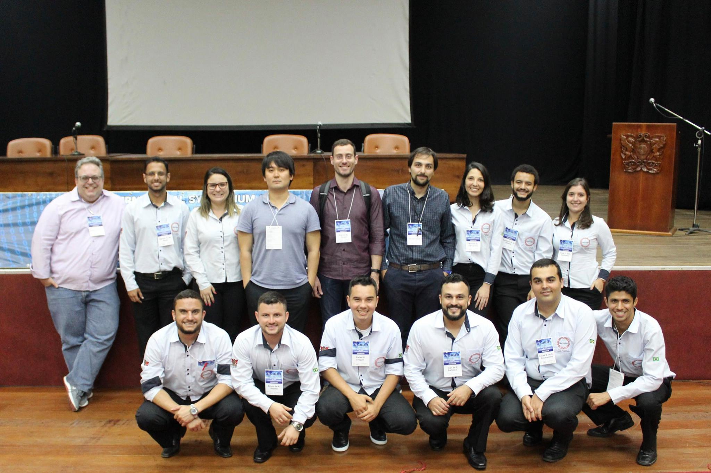
]

---
# IX SIGM @UFV October 2018
.pull-left[

]

.pull-right[

]


---
# Linear mixed model course @UFV October 2018


---
# Special seminar @UFV July 2019
.pull-left[
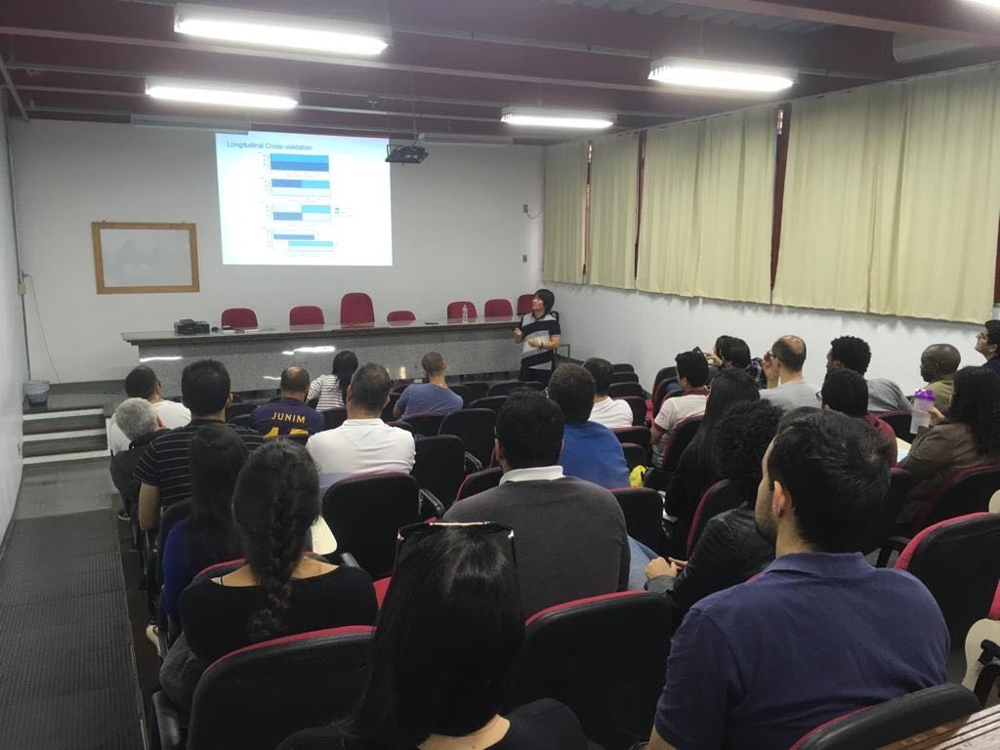
]

.pull-right[
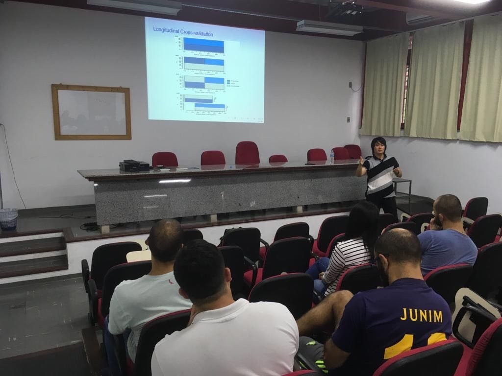
]

---
# Special seminar @UFV July 2019
.pull-left[

]

.pull-right[

]


---
# Special seminar @UFV July 2019
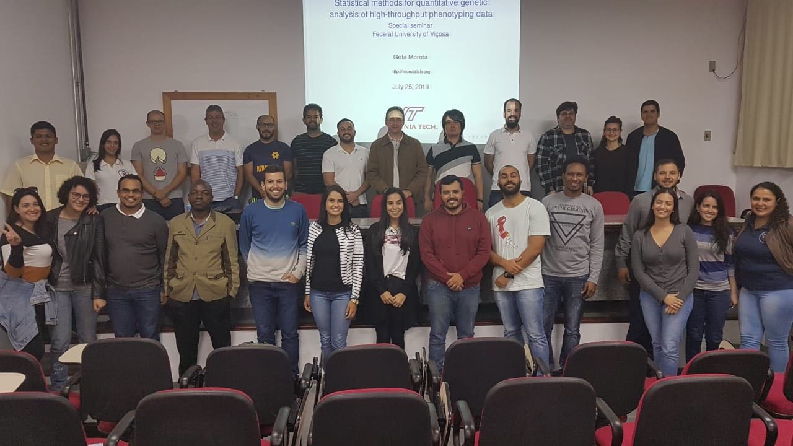


---
class: inverse, center, middle

# Quantitative Genetics

--

Analysis of complex or multifactorial traits 

--

All genes affect all traits - the question is by how much?

--

Infinitesimal model

--

Quasi-infinitesimal model, Oligogenic model


---

# What is quantitative genetics?

--

Population genetics
- **Mathematics** is language of population genetics, **population genetics** is language of **evolution**.

--

Quantitative genetics 
- **Statistics** is language of quantitative genetics, **quantitative genetics** is language of **complex trait genetics**. 

--

**Phenotypes** first in quantitative genetics

In the era of genomics, phenotype is **king**


<center>
<iframe src="https://giphy.com/embed/9ADoZQgs0tyww" width="400" height="200" frameBorder="0" class="giphy-embed" allowFullScreen></iframe><p><a href="https://giphy.com/gifs/obama-awesome-statistics-9ADoZQgs0tyww">via GIPHY</a></p>
</center>


---

# Regression model
Galton (1886). Regression towards mediocrity in hereditary stature
"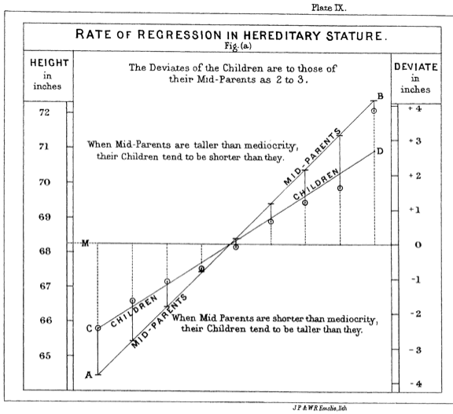


---

# Complex traits
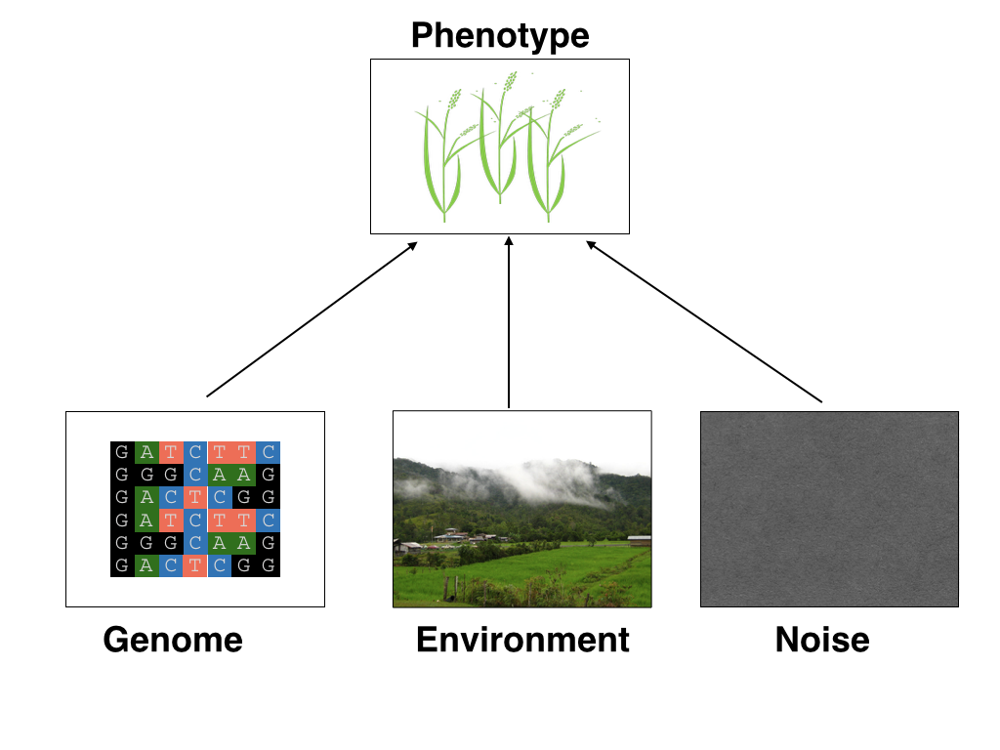


---
# Genetic values
Quantitative genetic model:

\begin{align*}
\mathbf{y} &= \mathbf{g} + \boldsymbol{\epsilon} \\
\end{align*}
where $\mathbf{y}$ is the vector of observed phenotypes, $\mathbf{g}$ is the vector of genetic values, and $\boldsymbol{\epsilon}$ is the vector of residuals. 

Example:

| Animal ID   | y           | g  |   e  |
| ------------- |:-------------:| -----:|------|
| 1      | 10 | ? |  ?     |
| 2      |  7     |   ? |  ?    |
| 3 | 12     |    ? |    ? |


---
# Genetic values
Quantitative genetic model:

\begin{align*}
\mathbf{y} &= \mathbf{g} + \boldsymbol{\epsilon} \\
\end{align*}
where $\mathbf{y}$ is the vector of observed phenotypes, $\mathbf{g}$ is the vector of genetic values, and $\boldsymbol{\epsilon}$ is the vector of residuals. 

Example:

| Animal ID    | y           | g  |   e  |
| ------------- |:-------------:| -----:|------|
| 1      | 10 | 5 |  5     |
| 2      |  7     |   6 |  1    |
| 3 | 12     |    2 |    10 |


--

Phenotypes can be observed and measured but genotypic and additive genetic effects cannot


---
# Conventional Phenotyping
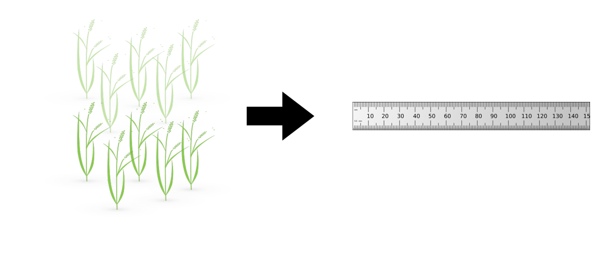

.pull-left[
- labor intensive

- prone to measurement error
]

.pull-right[
<iframe src="https://giphy.com/embed/Jk4ZT6R0OEUoM" width="500" height="160" frameBorder="0" class="giphy-embed" allowFullScreen></iframe><p><a href="https://giphy.com/gifs/Jk4ZT6R0OEUoM">via GIPHY</a></p>
]

---
# Genomic information (e.g., SNPs)
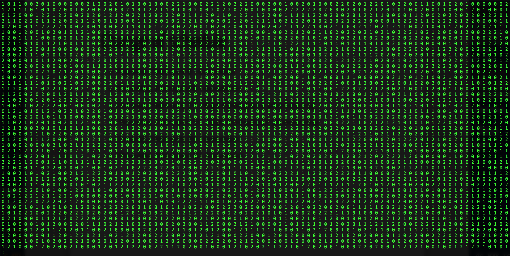

.center[Repeat of numbers 0, 1, and 2]


---
# Quantitative genetics
Connecting phenotypic data with genomic information<center>
<div>
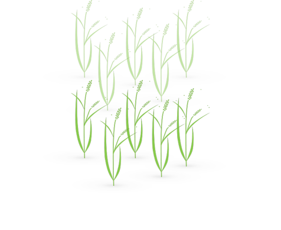
=
 + error 
</div>
</center>
\begin{align*}
\mathbf{y} &= \mathbf{g} + \boldsymbol{\epsilon} \\
 &\approx \mathbf{W}\mathbf{a} + \boldsymbol{\epsilon} 
\end{align*}
We approximate unknown $\mathbf{g}$ with $\mathbf{Wa}$. 
\begin{align*}
\underbrace{\begin{bmatrix}    
y_1\\
y_2\\
\vdots \\
y_n\end{bmatrix}}_{n \times 1}  
&= \underbrace{\begin{bmatrix}
   w_{11} & w_{12} & \cdots & w_{1m} \\
    w_{21} & w_{22} & \cdots & w_{2m} \\
    \vdots & \vdots & \ddots & \vdots \\
    w_{n1} & w_{n2} & \cdots & w_{nm}
\end{bmatrix}}_{n \times m} \quad
\underbrace{\begin{bmatrix}
a_1\\
a_2\\
\vdots \\
a_m\end{bmatrix}}_{m \times 1} 
+\underbrace{\begin{bmatrix}
\epsilon_1\\
\epsilon_2\\
\vdots \\
\epsilon_m\end{bmatrix}}_{n \times 1} 
\end{align*}

where $n$ is the number of individuals (e.g., accessions) and $m$ is the number of SNPs. 


---
# Precision agriculture using advanced technologies
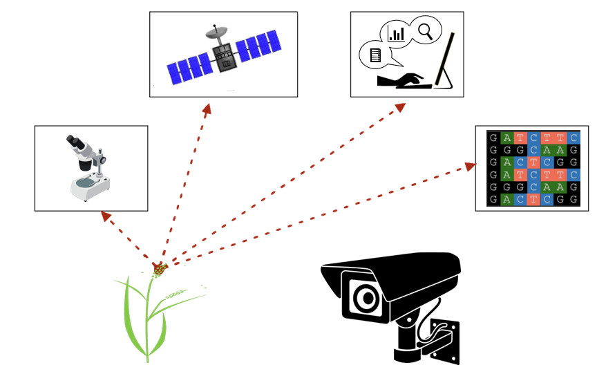


---
# Precision (digital) phenotyping
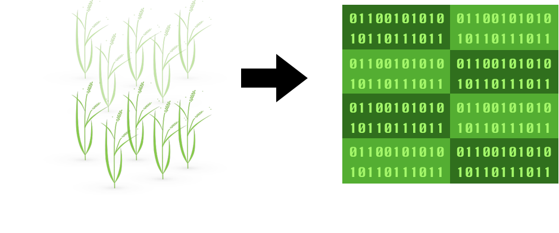


.pull-left[
- automated process

- less labor intensive

- less prone to measurement error
]

.pull-right[
<iframe src="https://giphy.com/embed/wW95fEq09hOI8" width="400" height="160" frameBorder="0" class="giphy-embed" allowFullScreen></iframe><p><a href="https://giphy.com/gifs/chihuahua-funny-cute-wW95fEq09hOI8">via GIPHY</a></p>
]


---
# Image phenotypes
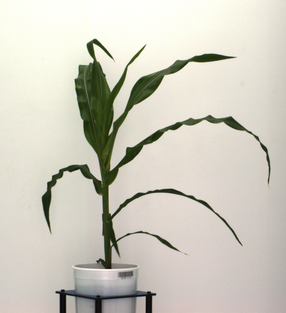
&nbsp;
&nbsp;


.center[Image data]


---
# Quantitative genetics
Connecting image data with genomic information 
<center>
<div>

=
 + error 
</div>
</center>
\begin{align*}
\mathbf{y} &= \mathbf{g} + \boldsymbol{\epsilon} \\
 &\approx \mathbf{W}\mathbf{a} + \boldsymbol{\epsilon} 
\end{align*}
We approximate unknown $\mathbf{g}$ with $\mathbf{Wa}$. 
\begin{align*}
\underbrace{\begin{bmatrix}    
y_1\\
y_2\\
\vdots \\
y_n\end{bmatrix}}_{n \times 1}  
&= \underbrace{\begin{bmatrix}
   w_{11} & w_{12} & \cdots & w_{1m} \\
    w_{21} & w_{22} & \cdots & w_{2m} \\
    \vdots & \vdots & \ddots & \vdots \\
    w_{n1} & w_{n2} & \cdots & w_{nm}
\end{bmatrix}}_{n \times m} \quad
\underbrace{\begin{bmatrix}
a_1\\
a_2\\
\vdots \\
a_m\end{bmatrix}}_{m \times 1} 
+\underbrace{\begin{bmatrix}
\epsilon_1\\
\epsilon_2\\
\vdots \\
\epsilon_m\end{bmatrix}}_{n \times 1} 
\end{align*}

where $n$ is the number of individuals (e.g., accessions) and $m$ is the number of SNPs. 


---
# Big in n or m?
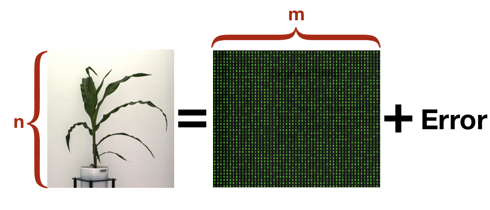
- $n$: number of individuals (records)

- $m$ number of SNPs (genetic markers)


---
# Prediction vs. Inference
Complex traits are controlled by large number of genes with small effects, and  influenced by both genetics and environments

- Inference (location)
    - average effects of allele substitution

- Inference (variability)
   - variance component estimation
   - genomic heritability
  
Combination of above two (e.g., estimate proportion of additive genetic variance explained by QTLs)

- Prediction 
    - genomic selection
    - prediction of yet-to-be observed phenotypes


---
# Prediction vs. Inference 
<div align="center">
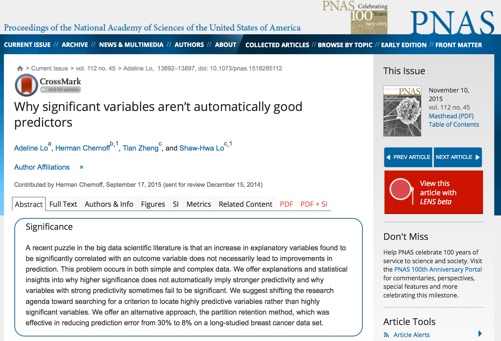
</div>

* [http://www.pnas.org/content/112/45/13892.abstract
](http://www.pnas.org/content/112/45/13892.abstract
)


---
# GWAS vs. Prediction

.right[[Wikimedia Commons](https://commons.wikimedia.org/wiki/File:Manhattan_Plot.png)]


---
# Single trait linear mixed model 
$$\mathbf{y = Xb + Zu + e}$$
<div align="center">
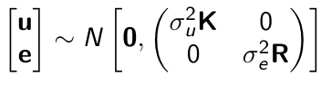
</div>

- $\mathbf{X}$: incidence matrix of systematic effects

- $\mathbf{Z}$: incidence matrix of random effects 

- $\mathbf{K}$: genomic relationship matrix

- $\mathbf{R}$: residual relationship matrix 

- $\sigma^2_{u}$: genomic variance; $\sigma^2_{e}$: residual variance

- BLUE: $\hat{\mathbf{b}} = (\mathbf{X'V^{-1}X})^{-}\mathbf{X'V^{-1}y}$; BLUP: $\hat{\mathbf{u}} = \mathbf{KZ'}\mathbf{V^{-1}}(\mathbf{y - X\hat{b}})$

- where $\mathbf{V} = \mathbf{ZK\sigma^2_{u}Z' + R\sigma^2_{e}}$

---
# Mixed model equations (Henderson)
The corresponding mixed model equations (MME) are
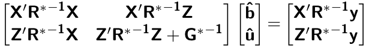

- $\mathbf{G}^* = \sigma^2_u \mathbf{K}$

- $\mathbf{R}^* = \sigma^2_e \mathbf{R}$

If we multipy $\mathbf{R}^* = \sigma^2_e\mathbf{I}$ to the both sides
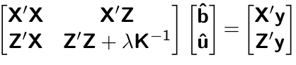

where $\lambda = \sigma^2_e / \sigma^2_u$

- MME produces BLUE (E-BLUE) and BLUP (E-BLUP) simultaneously 


---
# Decoding single trait MME
| N | Phe  | Env           | Gen  | 
| ------------- |:-------------:| -----:| -----:|
|1| 47      | E1 | G1 |
|2| 51      |  E1     |   G2 |
|3| 46 | E1     |    G3 |
|4| 58 | E1     |    G4 |
|5| 52 | E2     |    G1 |
|6| 46 | E2     |    G2 |
|7| 52 | E2     |    G3 |
|8| 54 | E2     |    G4 |
|9| 53 | E3     |    G1 |
|10| 48 | E3     |    G2 |
|11| 58 | E3     |    G3 |
|12| 52 | E3    |    G4 |


- Credit: [Alencar Xavier @Corteva](http://alenxav.wixsite.com/home)

---
# What is X?
| N | EnvE1  | EnvE2           | EnvE3  | 
| ------------- |:-------------:| -----:| -----:|
|1| 1     | 0 | 0 |
|2| 1      | 0     |   0 |
|3| 1 | 0     |    0 |
|4| 1 | 0     |    0 |
|5| 0 | 1     |    0 |
|6| 0 | 1     |    0 |
|7| 0 | 1     |    0 |
|8| 0 | 1     |    0 |
|9| 0 | 0     |    1 |
|10| 0 | 0     |    1 |
|11| 0 | 0     |    1 |
|12| 0 | 0    |    1 |

- $\mathbf{X}$ is the 12 x 3 matrix

---
# What is Z?
| N | GenG1  | GenG2           | GenG3  | GenG4 | 
| ------------- |:-------------:| -----:| -----:| -----:|
|1| 1     | 0 | 0 |0 |
|2| 0      | 1    |   0 |0 |
|3| 0 | 0     |    1 |0 |
|4| 0 | 0     |    0 |1 |
|5| 1 | 0     |    0 |0 |
|6| 0 | 1     |    0 |0 |
|7| 0 | 0     |    1 |0 |
|8| 0 | 0     |    0 |1 |
|9| 1 | 0     |    0 |0 |
|10| 0 | 1     |    0 |0 |
|11| 0 | 0     |    1 |0 |
|12| 0 | 0    |    0 |1 |

- $\mathbf{Z}$ is the 12 x 4 matrix


---
# What is X'X?

- $\mathbf{X'}$ is the 3 x 12 matrix

- $\mathbf{X}$ is the 12 x 3 matrix

- $\mathbf{X'X}$ is the 3 x 3 matrix

|  | EnvE1  | EnvE2           | EnvE3  | 
| ------------- |:-------------:| -----:| -----:|
|EnvE1| 4     | 0 | 0 |
|EnvE2| 0      | 4     |   0 |
|EnvE3| 0 | 0     |    4 |

--

- $\mathbf{X'X}$ is the 3 x 3 diagonal matrix counting the number of phenotypes observed in each environment 


---
# What is X'Z?

- $\mathbf{X'}$ is the 3 x 12 matrix

- $\mathbf{Z}$ is the 12 x 4 matrix

- $\mathbf{X'Z}$ is the 3 x 4 matrix

|  | GenG1  | GenG2           | GenG3  | GenG4 | 
| ------------- |:-------------:| -----:| -----:| -----:|
|EnvE1| 1     | 1 | 1 |1 |
|EnvE2| 1      | 1    |   1 |1 |
|EnvE3| 1 | 1     |    1 |1 |

--

- $\mathbf{X'Z}$ is the 3 x 4 matrix counting the number of each genotype in each environment 


---
# What is Z'X?
- $\mathbf{Z'}$ is the 4 x 12 matrix

- $\mathbf{X}$ is the 12 x 3 matrix

- $\mathbf{X'Z}$ is the 4 x 3 matrix

|  | EnvE1  | EnvE2           | EnvE3  | 
| ------------- |:-------------:| -----:| -----:|
|GenG1| 1     | 1 | 1 |
|GenG2| 1      | 1     |   1 |
|GenG3| 1 | 1     |    1 |
|GenG4| 1 | 1     |    1 |

- $\mathbf{Z'X}$ is the 4 x 3 matrix counting the number of each genotype in each environment 


---
# What is Z'Z?
- $\mathbf{Z'}$ is the 4 x 12 matrix

- $\mathbf{Z}$ is the 12 x 4 matrix

- $\mathbf{Z'Z}$ is the 4 x 4 matrix

|  | GenG1  | GenG2           | GenG3  | GenG4 | 
| ------------- |:-------------:| -----:| -----:| -----:|
|GenG1| 3     | 0 | 0 |0 |
|GenG2| 0      | 3   |   0 |0 |
|GenG3| 0 | 0     |    3 |0 |
|GenG4| 0 |0     |    0 |3|

- $\mathbf{Z'Z}$ is the 4 x 4 diagonal matrix counting the number of phenotypes observed for each genotype 


---
# What is Z'Z + $\lambda \mathbf{K}^{-1}$?
- $\mathbf{Z'}$ is the 4 x 12 matrix

- $\mathbf{Z}$ is the 12 x 4 matrix

- $\mathbf{Z'Z}$ is the 4 x 4 matrix

--

- assume $\mathbf{K} = \mathbf{I}$ (no relationship)

- $\lambda = \sigma^2_e / \sigma^2_u = 1.64/9.56 = 0.17$

--

|  | GenG1  | GenG2           | GenG3  | GenG4 | 
| ------------- |:-------------:| -----:| -----:| -----:|
|GenG1| 3.17     | 0 | 0 |0 |
|GenG2| 0      | 3.17   |   0 |0 |
|GenG3| 0 | 0     |    3.17 |0 |
|GenG4| 0 |0     |    0 |3.17|

- $\mathbf{Z'Z} + \lambda \mathbf{I}$ is the 4 x 4 diagonal matrix counting the number of phenotypes observed for each genotype + $\lambda$ value in the diagonal elements

---
# What is the left hand side of MME?
<div align="center">
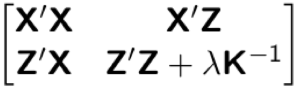
</div>


|  | EnvE1  | EnvE2           | EnvE3  | GenG1  | GenG2  | GenG3  | GenG4  | 
| ------------- |:-------------:| -----:| -----:|-----:| -----:|-----:| -----:|
|EnvE1| 4     | 0 | 0 |1 |1 |1 |1 |
|EnvE2| 0     | 4 | 0 |1 |1 |1 |1 |
|EnvE3| 0     | 0 | 4 |1 |1 |1 |1 |
|GenG1| 1      | 1     |   1 |3.17 |0 |0 |0 |
|GenG2| 1      | 1     |   1 |0 |3.17 |0 |0 |
|GenG3| 1 | 1     |    1 |0 |0 |3.17 |0 |
|GenG4| 1 | 1     |    1 |0 |0 |0 |3.17 |


---
# What is X'y?
- $\mathbf{X'}$ is the 3 x 12 matrix

- $\mathbf{y}$ is the 12 x 1 matrix

- $\mathbf{X'y}$ is the 3 x 1 matrix

|  |   | 
| ------------- |:-------------:| 
|EnvE1| 202     |
|EnvE2| 204      | 
|EnvE3| 211 | 

--

- $\mathbf{X'y}$ is the 3 x1 matrix counting the sum of phenotypes in each environment

---
# What is Z'y?
- $\mathbf{Z'}$ is the 4 x 12 matrix

- $\mathbf{y}$ is the 12 x 1 matrix

- $\mathbf{Z'y}$ is the 4 x 1 matrix

|  |   | 
| ------------- |:-------------:| 
|GenG1| 152     |
|GenG2| 145      | 
|GenG3| 156 | 
|GenG4| 164 | 

--

- $\mathbf{Z'y}$ is the 4 x1 matrix counting the sum of phenotypes for each genotype


---
# What is the right hand side of MME?
<div align="center">
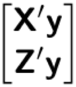
</div>

|  |   | 
| ------------- |:-------------:| 
|EnvE1| 202     |
|EnvE2| 204      | 
|EnvE3| 211 | 
|GenG1| 152     |
|GenG2| 145      | 
|GenG3| 156 | 
|GenG4| 164 | 


---
# Solutions
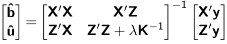

|  |   | 
| ------------- |:-------------:| 
|EnvE1| 50.50     |
|EnvE2| 51.00      | 
|EnvE3| 52.75 | 
|GenG1| -0.71     |
|GenG2| -2.92      | 
|GenG3| 0.55 | 
|GenG4| 3.08 | 

- These are BLUE and BLUP of environments and genotypes, respectively


---
# The role of lambda

BLUE = sum / $n_{x}$ = the sum of phenotypes in each environment / the number of phenotypes observed in each environment 

- BLUE is simply computing averages 

BLUP = sum / $n_{z} + \lambda$ = the sum of phenotypes for each genotype / the number of phenotypes observed for each genotype + $\lambda$

- BLUP is shrinked toward zero (proportional to $\lambda$)

--

Note that $\lambda = \frac{1-h^2}{h^2}$
- More observations $\rightarrow$ less shrinkage 

- Higher heritability $\rightarrow$ less shrinkage 


---
# Genomic relationship matrix
1: The first type of $\mathbf{G}$ matrix

$\mathbf{G} = \frac{\mathbf{W_c}\mathbf{W_c'}}{\sum 2 p_j (1-p_j)}$

- $\mathbf{W_c}$: centered marker matrix

- $p_j$: allele frequency at $j$th marker 


2: The second type of $\mathbf{G}$ matrix

$\mathbf{G} = \frac{\mathbf{W_{cs}}\mathbf{W_{cs}'}}{m}$

- $\mathbf{W_{cs}}$: centered and scaled marker matrix

- $m$: number of markers  


---
# Genomic relationship matrix
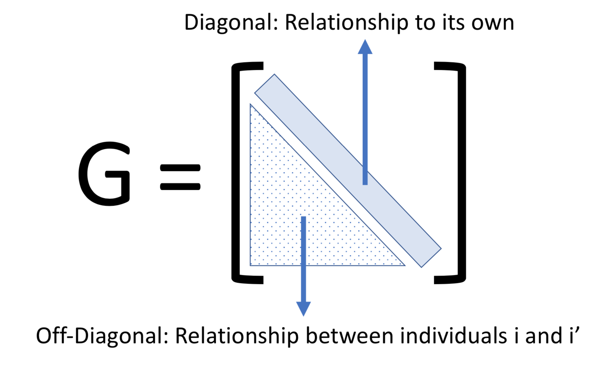


---
# When relationships are known
Suppose $\mathbf{K}$ is given by 

|  | GenG1  | GenG2           | GenG3  | GenG4 | 
| ------------- |:-------------:| -----:| -----:| -----:|
|GenG1| 1.00     | 0.64 | 0.23 |0.48 |
|GenG2| 0.64      | 1.00   |   0.33 |0.67 |
|GenG3| 0.23 | 0.33     |    1.00 |0.31 |
|GenG4| 0.48 |0.67     |    0.31 |1.00|

--

Then $\lambda \mathbf{K}^{-1}$ is

|  | GenG1  | GenG2           | GenG3  | GenG4 | 
| ------------- |:-------------:| -----:| -----:| -----:|
|GenG1| 0.15     | -0.09 | 0.00 |-0.01 |
|GenG2| -0.09      | 0.22   |   -0.02 |-0.10 |
|GenG3| 0.00 | -0.02     |    0.10 |-0.02 |
|GenG4| -0.01 |-0.10     |    -0.02 |0.17|

- $\lambda = \sigma^2_e / \sigma^2_u = 1.64/17.70 = 0.09$


---
# What is the left hand side of MME?
<div align="center">

</div>


|  | EnvE1  | EnvE2           | EnvE3  | GenG1  | GenG2  | GenG3  | GenG4  | 
| ------------- |:-------------:| -----:| -----:|-----:| -----:|-----:| -----:|
|EnvE1| 4     | 0 | 0 |1 |1 |1 |1 |
|EnvE2| 0     | 4 | 0 |1 |1 |1 |1 |
|EnvE3| 0     | 0 | 4 |1 |1 |1 |1 |
|GenG1| 1      | 1     |   1 |3.15 |-0.09 |0.00 |-0.01 |
|GenG2| 1      | 1     |   1 |-0.09 |3.22 |-0.02 |-0.10 |
|GenG3| 1 | 1     |    1 |0.00 |-0.02 |3.10 |-0.02 |
|GenG4| 1 | 1     |    1 |-0.01 |-0.10 |-0.02 |3.17 |


---
# When there are missing phenotypes
.pull-left[
| N | Phe  | Env           | Gen  | 
| ------------- |:-------------:| -----:| -----:|
|1| 47      | E1 | G1 |
|2| 51      |  E1     |   G2 |
|3| NA | E1     |    G3 |
|4| 58 | E1     |    G4 |
|5| 52 | E2     |    G1 |
|6| 46 | E2     |    G2 |
|7| 52 | E2     |    G3 |
|8| NA | E2     |    G4 |
|9| 53 | E3     |    G1 |
|10| 48 | E3     |    G2 |
|11| 58 | E3     |    G3 |
|12| 52 | E3    |    G4 |
]

.pull-right[
<iframe src="https://giphy.com/embed/3o85xpBDDNSAQsbu2A" width="480" height="360" frameBorder="0" class="giphy-embed" allowFullScreen></iframe><p><a href="https://giphy.com/gifs/afvbabies-babies-afv-3o85xpBDDNSAQsbu2A">via GIPHY</a></p>
]


---
# What is X?

| N | EnvE1  | EnvE2           | EnvE3  | 
| ------------- |:-------------:| -----:| -----:|
|1| 1     | 0 | 0 |
|2| 1      | 0     |   0 |
|4| 1 | 0     |    0 |
|5| 0 | 1     |    0 |
|6| 0 | 1     |    0 |
|7| 0 | 1     |    0 |
|9| 0 | 0     |    1 |
|10| 0 | 0     |    1 |
|11| 0 | 0     |    1 |
|12| 0 | 0    |    1 |

- Remove missing rows

- $\mathbf{X}$ is the 10 x 3 matrix


---
# What is Z?

| N | GenG1  | GenG2           | GenG3  | GenG4 | 
| ------------- |:-------------:| -----:| -----:| -----:|
|1| 1     | 0 | 0 |0 |
|2| 0      | 1    |   0 |0 |
|4| 0 | 0     |    0 |1 |
|5| 1 | 0     |    0 |0 |
|6| 0 | 1     |    0 |0 |
|7| 0 | 0     |    1 |0 |
|9| 1 | 0     |    0 |0 |
|10| 0 | 1     |    0 |0 |
|11| 0 | 0     |    1 |0 |
|12| 0 | 0    |    0 |1 |

- Remove missing rows

- $\mathbf{Z}$ is the 10 x 4 matrix


---
# What is X'X?

- $\mathbf{X'}$ is the 3 x 10 matrix

- $\mathbf{X}$ is the 10 x 3 matrix

- $\mathbf{X'X}$ is the 3 x 3 matrix

|  | EnvE1  | EnvE2           | EnvE3  | 
| ------------- |:-------------:| -----:| -----:|
|EnvE1| 3     | 0 | 0 |
|EnvE2| 0      | 3     |   0 |
|EnvE3| 0 | 0     |    4 |

--

- $\mathbf{X'X}$ is the 3 x 3 diagonal matrix counting the number of phenotypes observed in each environment 


---
# What is X'Z?

- $\mathbf{X'}$ is the 3 x 10 matrix

- $\mathbf{Z}$ is the 10 x 4 matrix

- $\mathbf{X'Z}$ is the 3 x 4 matrix

|  | GenG1  | GenG2           | GenG3  | GenG4 | 
| ------------- |:-------------:| -----:| -----:| -----:|
|EnvE1| 1     | 1 | 0 |1 |
|EnvE2| 1      | 1    |   1 |0 |
|EnvE3| 1 | 1     |    1 |1 |

--

- $\mathbf{X'Z}$ is the 3 x 4 matrix counting the number of each genotype in each environment 


---
# What is Z'X?
- $\mathbf{Z'}$ is the 4 x 10 matrix

- $\mathbf{X}$ is the 10 x 3 matrix

- $\mathbf{X'Z}$ is the 4 x 3 matrix

|  | EnvE1  | EnvE2           | EnvE3  | 
| ------------- |:-------------:| -----:| -----:|
|GenG1| 1     | 1 | 1 |
|GenG2| 1      | 1     |   1 |
|GenG3| 0 | 1     |    1 |
|GenG4| 1 | 0     |    1 |

- $\mathbf{Z'X}$ is the 4 x 3 matrix counting the number of each genotype in each environment 


---
# What is Z'Z?
- $\mathbf{Z'}$ is the 4 x 10 matrix

- $\mathbf{Z}$ is the 4 x 10 matrix

- $\mathbf{Z'Z}$ is the 4 x 4 matrix

|  | GenG1  | GenG2           | GenG3  | GenG4 | 
| ------------- |:-------------:| -----:| -----:| -----:|
|GenG1| 3     | 0 | 0 |0 |
|GenG2| 0      | 3   |   0 |0 |
|GenG3| 0 | 0     |    2 |0 |
|GenG4| 0 |0     |    0 |2|

- $\mathbf{Z'Z}$ is the 4 x 4 diagonal matrix counting the number of phenotypes observed for each genotype 


---
# What is the left hand side of MME?
<div align="center">

</div>


|  | EnvE1  | EnvE2           | EnvE3  | GenG1  | GenG2  | GenG3  | GenG4  | 
| ------------- |:-------------:| -----:| -----:|-----:| -----:|-----:| -----:|
|EnvE1| 3     | 0 | 0 |1 |1 |0 |1 |
|EnvE2| 0     | 3 | 0 |1 |1 |1 |0 |
|EnvE3| 0     | 0 | 4 |1 |1 |1 |1 |
|GenG1| 1      | 1     |   1 |3.10 |-0.06 |0.00 |-0.01 |
|GenG2| 1      | 1     |   1 |-0.06 |3.15 |-0.01 |-0.07 |
|GenG3| 0 | 1     |    1 |0.00 |-0.01 |2.07 |-0.01 |
|GenG4| 1 | 0     |    1 |-0.01 |-0.07 |-0.01 |2.11 |

- $\lambda = \sigma^2_e / \sigma^2_u = 1.64/19.61 = 0.06$


---
# What is the right hand side of MME?
<div align="center">

</div>

|  |   | 
| ------------- |:-------------:| 
|EnvE1| 156     |
|EnvE2| 150      | 
|EnvE3| 211 | 
|GenG1| 152     |
|GenG2| 145      | 
|GenG3| 110 | 
|GenG4| 110 | 


---
# The first genotype is missing phenotypes
.pull-left[
| N | Phe  | Env           | Gen  | 
| ------------- |:-------------:| -----:| -----:|
|1| NA      | E1 | G1 |
|2| 51      |  E1     |   G2 |
|3| 46 | E1     |    G3 |
|4| 58 | E1     |    G4 |
|5| NA | E2     |    G1 |
|6| 46 | E2     |    G2 |
|7| 52 | E2     |    G3 |
|8| 54 | E2     |    G4 |
|9| NA | E3     |    G1 |
|10| 48 | E3     |    G2 |
|11| 58 | E3     |    G3 |
|12| 52 | E3    |    G4 |
]

.pull-right[
<center>
<iframe src="https://giphy.com/embed/lKZEeXJGhU1d6" width="300" height="350" frameBorder="0" class="giphy-embed" allowFullScreen></iframe><p><a href="https://giphy.com/gifs/scared-despicable-me-lKZEeXJGhU1d6">via GIPHY</a>
</p>
</center>
]

---
# What is X?
| N | EnvE1  | EnvE2           | EnvE3  | 
| ------------- |:-------------:| -----:| -----:|
|2| 1      | 0     |   0 |
|3| 1 | 0     |    0 |
|4| 1 | 0     |    0 |
|6| 0 | 1     |    0 |
|7| 0 | 1     |    0 |
|8| 0 | 1     |    0 |
|10| 0 | 0     |    1 |
|11| 0 | 0     |    1 |
|12| 0 | 0    |    1 |

- Remove missing rows

- $\mathbf{X}$ is the 9 x 3 matrix

---
# What is Z?
| N | GenG1  | GenG2           | GenG3  | GenG4 | 
| ------------- |:-------------:| -----:| -----:| -----:|
|2| 0      | 1    |   0 |0 |
|3| 0 | 0     |    1 |0 |
|4| 0 | 0     |    0 |1 |
|6| 0 | 1     |    0 |0 |
|7| 0 | 0     |    1 |0 |
|8| 0 | 0     |    0 |1 |
|10| 0 | 1     |    0 |0 |
|11| 0 | 0     |    1 |0 |
|12| 0 | 0    |    0 |1 |

- Remove missing rows

- $\mathbf{Z}$ is the 9 x 4 matrix


---
# What is X'X?

- $\mathbf{X'}$ is the 3 x 9 matrix

- $\mathbf{X}$ is the 9 x 3 matrix

- $\mathbf{X'X}$ is the 3 x 3 matrix

|  | EnvE1  | EnvE2           | EnvE3  | 
| ------------- |:-------------:| -----:| -----:|
|EnvE1| 3     | 0 | 0 |
|EnvE2| 0      | 3     |   0 |
|EnvE3| 0 | 0     |    3 |

--

- $\mathbf{X'X}$ is the 3 x 3 diagonal matrix counting the number of phenotypes observed in each environment 


---
# What is X'Z?

- $\mathbf{X'}$ is the 3 x 9 matrix

- $\mathbf{Z}$ is the 9 x 4 matrix

- $\mathbf{X'Z}$ is the 3 x 4 matrix

|  | GenG1  | GenG2           | GenG3  | GenG4 | 
| ------------- |:-------------:| -----:| -----:| -----:|
|EnvE1| 0     | 1 | 1 |1 |
|EnvE2| 0      | 1    |   1 |1 |
|EnvE3| 0 | 1     |    1 |1 |

--

- $\mathbf{X'Z}$ is the 3 x 4 matrix counting the number of each genotype in each environment 


---
# What is Z'X?
- $\mathbf{Z'}$ is the 4 x 12 matrix

- $\mathbf{X}$ is the 12 x 3 matrix

- $\mathbf{X'Z}$ is the 4 x 3 matrix

|  | EnvE1  | EnvE2           | EnvE3  | 
| ------------- |:-------------:| -----:| -----:|
|GenG1| 0     | 0 | 0 |
|GenG2| 1      | 1     |   1 |
|GenG3| 1 | 1     |    1 |
|GenG4| 1 | 1     |    1 |

- $\mathbf{Z'X}$ is the 4 x 3 matrix counting the number of each genotype in each environment 


---
# What is Z'Z?
- $\mathbf{Z'}$ is the 4 x 9 matrix

- $\mathbf{Z}$ is the 4 x 9 matrix

- $\mathbf{Z'Z}$ is the 4 x 4 matrix

|  | GenG1  | GenG2           | GenG3  | GenG4 | 
| ------------- |:-------------:| -----:| -----:| -----:|
|GenG1| 0     | 0 | 0 |0 |
|GenG2| 0      | 3   |   0 |0 |
|GenG3| 0 | 0     |    3 |0 |
|GenG4| 0 |0     |    0 |3|

- $\mathbf{Z'Z}$ is the 4 x 4 diagonal matrix counting the number of phenotypes observed for each genotype 


---
# What is the left hand side of MME?
<div align="center">

</div>


|  | EnvE1  | EnvE2           | EnvE3  | GenG1  | GenG2  | GenG3  | GenG4  | 
| ------------- |:-------------:| -----:| -----:|-----:| -----:|-----:| -----:|
|EnvE1| 3     | 0 | 0 |0 |1 |0 |1 |
|EnvE2| 0     | 3 | 0 |0 |1 |1 |0 |
|EnvE3| 0     | 0 | 3 |0 |1 |1 |1 |
|GenG1| 0      | 0     |   0 |0.14 |-0.08 |0.00 |-0.01 |
|GenG2| 1      | 1     |   1 |-0.08 |3.19 |-0.02 |-0.09 |
|GenG3| 0 | 1     |    1 |0.00 |-0.02 |3.09 |-0.01 |
|GenG4| 1 | 0     |    1 |-0.01 |-0.09 |-0.01 |3.15 |

- $\lambda = \sigma^2_e / \sigma^2_u = 1.79/22.78 = 0.08$


---
# What is the right hand side of MME?
<div align="center">

</div>

|  |   | 
| ------------- |:-------------:| 
|EnvE1| 155    |
|EnvE2| 152      | 
|EnvE3| 158 | 
|GenG1| 0     |
|GenG2| 145      | 
|GenG3| 156 | 
|GenG4| 164 | 

---
# Solutions


|  |   | 
| ------------- |:-------------:| 
|EnvE1| 52.06     |
|EnvE2| 51.06      | 
|EnvE3| 53.06 | 
|GenG1| -1.82     |
|GenG2| -3.48      | 
|GenG3| -0.07 | 
|GenG4| 2.38 | 

- These are BLUE and BLUP of environments and genotypes, respectively


---
# Dimension of left hand side
<div align="center">
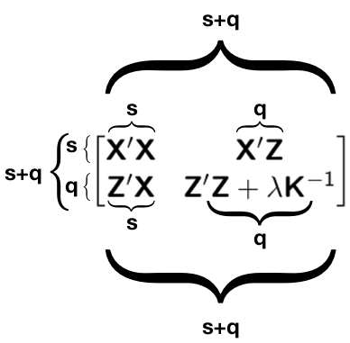
</div>


.pull-left[
- s: number of unique fixed effects

- q: number of unique genotypes

- does not depend on $n$
]

.pull-right[
<center>
<iframe src="https://giphy.com/embed/UgD64OxiNyTBK" width="421" height="250" frameBorder="0" class="giphy-embed" allowFullScreen></iframe><p><a href="https://giphy.com/gifs/funny-lol-guitarhero-UgD64OxiNyTBK">via GIPHY</a></p>
</center>
]


---
# Extending a linear mixed model for GWAS
Previous model 
$$\mathbf{y = Xb + Zu + e}$$
</br>

Linear mixed model single-marker regression 
$$\mathbf{y = Xb + Wa + Zu + e}$$

- $\mathbf{W}$: marker matrix

- $\mathbf{a}$: vector of marker effect


---
# Linear mixed model for GWAS 
Single marker-based mixed model association (MMA)
\begin{align*}
\mathbf{y} &= \mu + \mathbf{w_ja_j} + \mathbf{Zg} + \boldsymbol{\epsilon} \\
\mathbf{g} &\sim N(0, \mathbf{G}\sigma^2_{g})
\end{align*}

$\mathbf{G}$ captures population structure and polygenic effects


--

Double counting?

--

Alternatively, 
\begin{align*}
\mathbf{y} &= \mu + \mathbf{w_ja_j} + \mathbf{Zg} + \boldsymbol{\epsilon} \\
\mathbf{g} &\sim N(0, \mathbf{G}_{-k}\sigma^2_{g_{-k}})
\end{align*}
where $-k$ denotes the $k$th chromosome removed

See
* Rincent et al. 2014. ([10.1534/genetics.113.159731](https://doi.org/10.1534/genetics.113.159731))

* Chen and Lipka. 2016. ([10.1534/g3.116.029090](https://doi.org/10.1534/g3.116.029090))


---
# How to solve the linear mixed model?

1:  Mixed model equations (MME)
\begin{align*}
\mathbf{y} &= \mu + \mathbf{w_ja_j} + \mathbf{Zg} + \boldsymbol{\epsilon} \\
\end{align*}

The mixed model equations of [Henderson (1949)](http://morotalab.org/literature/pdf/henderson1949.pdf) are given by 

<div align="center">
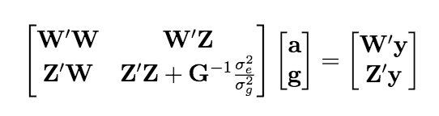
</div>

2:  Weighted least squares
\begin{align*}
  \hat{\mathbf{a}} &= (\mathbf{W'U T U'W})^{-1}\mathbf{W'U} \mathbf{T} \mathbf{U'y} 
\end{align*}
where

- $\mathbf{U}$: eigenvectors of the $\mathbf{G}$ matrix
- $\mathbf{D}$: eigenvalues of the $\mathbf{G}$ matrix

\begin{align*}
\mathbf{T} = [\mathbf{D}  + \lambda \mathbf{I}  ]^{-1}
\end{align*}


---
# Important literature
Animal 

* [Kennedy et al. 1992.](https://doi.org/10.2527/1992.7072000x) Estimation of effects of single genes on quantitative traits. J Anim Sci. 70:2000-2012.

Plant 

* [Yu et al. 2006.](https://dx.doi.org/10.1038/ng1702) A unified mixed-model method for association mapping that accounts for multiple levels of relatedness. Nat Genet. 38:203-208. 


---
# Bibliography
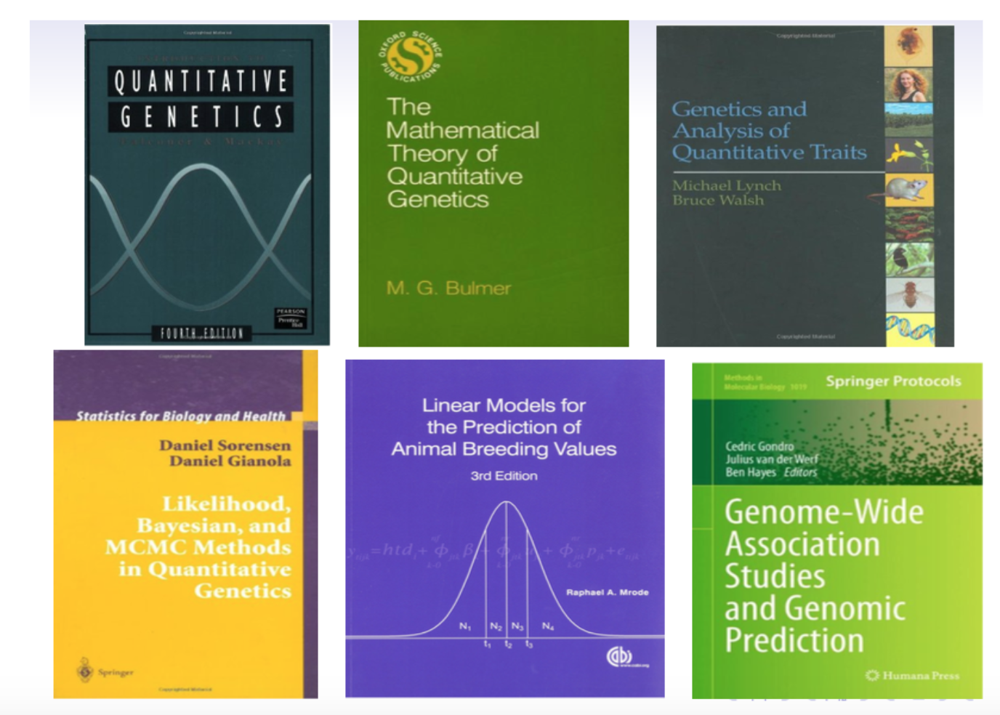

