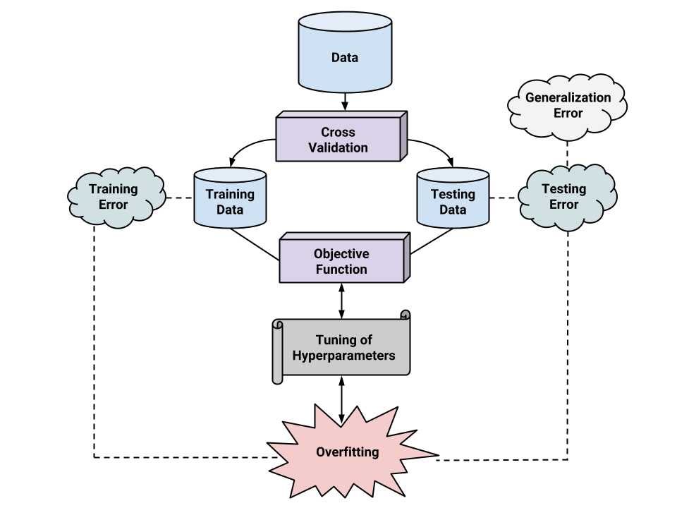

```{r setup, include=FALSE}
options(htmltools.dir.version = FALSE)

library(plotly)
library(tidyverse)
library(htmlwidgets)
```


class: inverse, center, middle

# Genomic BLUP


---
# Expectation and variance 
Define the random variable $W$ which counts the number of reference allele $A$.
\begin{align*}
  W &=
  \begin{cases}
    2 & \text{if } AA  \text{ with frequency } p^2 \\
    1 & \text{if } Aa \text{ with frequency } 2p(1-p) \\
    0 & \text{if } aa \text{ with frequency } (1-p)^2
  \end{cases} \\
\end{align*}
where $p$ is the allele frequency of $A$. 

--

Then, 
\begin{align*}
E[W] &= 0 \times (1 - p_j)^2 + 1 \times [2p(1-p)] + 2 \times p^2 \\
&= 2p \\
E[W^2] &= 0^2 \times (1 - p_j)^2 + 1^2 \times [2p(1-p)] + 2^2 \times p^2 \\
&= 2p(1-p) + 4p^2 \\
\end{align*}
Thus, the variance of allelic counts is 
\begin{align*}
Var(W) &= E[W^2] - E[W]^2 \\
&= 2p(1-p) + 4p^2  - 4p^2\\
&= 2p(1-p)
\end{align*}


---
# Alternative coding 
Define the random variable $W$ which counts the number of reference allele $A$.
\begin{align*}
  W &=
  \begin{cases}
    1 & \text{if } AA  \text{ with frequency } p^2 \\
    0 & \text{if } Aa \text{ with frequency } 2p(1-p) \\
    -1 & \text{if } aa \text{ with frequency } (1-p)^2
  \end{cases} \\
\end{align*}
where $p$ is the allele frequency of $A$. 

--

Then, 
\begin{align*}
E[W] &= -1 \times (1 - p_j)^2 + 0 \times [2p(1-p)] + 1 \times p^2 \\
&= −(1 − 2p + p^2) + p^2 = 2p-1 \\
E[W^2] &= (-1)^2 \times (1 - p_j)^2 + 0^2 \times [2p(1-p)] + 1^2 \times p^2 \\
&= 1 − 2p + p^2 +p^2  = 2p^2 − 2p + 1 \\
\end{align*}
Thus, the variance of allelic counts is 
\begin{align*}
Var(W) &= E[W^2] - E[W]^2 \\
&= 2p^2 − 2p + 1 − (4p^2 − 4p + 1)\\
&= -2p^2 + 2p = 2p(1-p)
\end{align*}


---
# Centered marker codes  

\begin{align*}
  W - E(W) &=
  \begin{cases}
    2 -2p & \text{if } AA  \text{ with frequency } p^2 \\
    1 - 2p & \text{if } Aa \text{ with frequency } 2p(1-p) \\
    0 - 2p & \text{if } aa \text{ with frequency } (1-p)^2
  \end{cases} \\
\end{align*}


\begin{align*}
  W - E(W) &=
  \begin{cases}
    1 - (2p-1) = 2 -2p& \text{if } AA  \text{ with frequency } p^2 \\
    0 - (2p-1)  = 1 - 2p & \text{if } Aa \text{ with frequency } 2p(1-p) \\
    -1 - (2p-1) = 0 - 2p & \text{if } aa \text{ with frequency } (1-p)^2
  \end{cases} \\
\end{align*}
where $p$ is the allele frequency of $A$. 

Therefore, the variance and the centered codes are the same. 


---
# Genomic relationship matrix (1)
Recall that
\begin{align*}
\mathbf{y} &= \mathbf{g} + \boldsymbol{\epsilon} = \mathbf{W}_c\mathbf{a} + \boldsymbol{\epsilon}
\end{align*}

Assume genetic value is parameterized as $g_{i} = \sum w_{ij} a_j$
where both $w$ and $a$ are treated as random and independent. 
Assuming linkage equilibrium of markers (all loci are mutually independent) 
\begin{align*}
\sigma^2_g &= \sum_j 2 p_j(1-p_j) \cdot \sigma^2_{a_j}. \notag \\
\end{align*}
Under the homogeneous marker variance assumption
\begin{align}
\sigma^2_{a} &= \frac{\sigma^2_g}{2 \sum_j p_j(1-p_j) }.
\end{align}
Then, variance of genetic values is 
\begin{align*}
Var(\mathbf{g}) &= Var(\mathbf{W}_c\mathbf{a}) = \mathbf{W_cW'_c}\sigma^2_{a} \\
&= \frac{\mathbf{W_cW'_c}}{2 \sum_j p_j(1-p_j)} \sigma^2_g = \mathbf{G}\sigma^2_g
\end{align*}


---
# Genomic relationship matrix (2)
Similarly, 
\begin{align*}
\sigma^2_g &=   \sum^m_{j=1} 2p_{j}(1 - p_j)\sigma^2_{a}  \\
&= m \sigma^2_{a}
\end{align*}

- homogeneous marker variance assumption

- if assumed that all markers have variance 1 (following standardizing marker genotypes) 

- the marked genetic variance is given by the sum of individual marker variances 

\begin{align*}
\sigma^2_{a} = \sigma^2_g / m
\end{align*}


Then, variance of genetic values is 
\begin{align*}
Var(\mathbf{g}) &= Var(\mathbf{W}_{cs}\mathbf{a}) = \mathbf{W_{cs}W'_{cs}}\sigma^2_{a} \\
&= \frac{\mathbf{W_{cs}W'_{cs}}}{m} \sigma^2_g = \mathbf{G}\sigma^2_g
\end{align*}


---
# Genomic best linear unbiased prediction
Suppose underlying signal is given by  
$$
\mathbf{y} = \mathbf{g} + \boldsymbol{\epsilon}
$$

where $\mathbf{g} \sim N(0, \mathbf{G}\sigma^2_g)$. 

We approximate the vector of genetic values $\mathbf{g}$ with a linear function  

$$
\mathbf{y} = \mathbf{W}\mathbf{a} + \boldsymbol{\epsilon}
$$

- $\mathbf{W}$ is the centered $n$ $\times$ $m$ matrix of additive marker genotypes 

- $\mathbf{a}$ is the vector of regression coefficients on marker genotypes 

- $\boldsymbol{\epsilon}$ is the residual 


---
# Genomic best linear unbiased prediction
Variance-covariance matrix of $\mathbf{y}$ is
\begin{align*}
\mathbf{V}_y &= \mathbf{V}_g + \mathbf{V}_{\epsilon} \\
&= \mathbf{WW'}\sigma^2_{a} + \mathbf{I} \sigma^2_{\epsilon}
\end{align*}

- $\mathbf{a} \sim N(0, \mathbf{I}\sigma^2_{\mathbf{a}})$  

- $\boldsymbol{\epsilon} \sim N(0, \mathbf{I}\sigma^2_{\boldsymbol{\epsilon}})$

- $\mathbf{V}_g = \mathbf{WW'}\sigma^2_{a}$ is the covariance matrix due to markers


---
# Genomic best linear unbiased prediction
If normality is assumed, the best linear unbiased prediction (BLUP) of $\mathbf{g}$ $(\hat{\mathbf{g}})$ is the conditional mean of $\mathbf{g}$ given the data  
\begin{align}
BLUP(\hat{\mathbf{g}}) &= E(\mathbf{g}|\mathbf{y}) = E[\mathbf{g}] + Cov(\mathbf{g}, \mathbf{y}^T) Var(\mathbf{y})^{-1}  [\mathbf{y} - E(\mathbf{y})] \notag \\
&=  Cov(\mathbf{W}\mathbf{a}, \mathbf{y}^T)\cdot \mathbf{V}_y^{-1}  \mathbf{y}  \notag \\
&= \mathbf{WW'}\sigma^2_{\mathbf{a}} [\mathbf{WW'}\sigma^2_{a} + \mathbf{I} \sigma^2_{\epsilon}]^{-1}  \mathbf{y}  \notag \\
&= [\mathbf{I} +    \frac{\sigma^2_{\epsilon}}{\mathbf{WW'}\sigma^2_{a}} ]^{-1}  \mathbf{y}  \\
&= [\mathbf{I} +  (\mathbf{WW'})^{-1}  \frac{\sigma^2_{\epsilon}}{\sigma^2_{a}} ]^{-1}  \mathbf{y}, 
\end{align}
assuming that $\mathbf{WW'}$ is invertible

- $Cov(\mathbf{W}) = \mathbf{WW'}$  is a covariance matrix of marker genotypes (provided that $X$ is centered), often considered to be the simplest form of additive genomic relationship kernel, $\mathbf{G}$. 


---
# Genomic best linear unbiased prediction
We can refine this kernel $Cov(\mathbf{W}) = \mathbf{WW'}$ by relating genetic variance $\sigma^2_g$ and marker genetic variance $\sigma^2_{a}$ under the following assumptions

Assume genetic value is parameterized as 
$g_{i} = \sum w_{ij} a_j$ 
where both $x$ and $a$ are treated as random and independent. 

Assuming linkage  equilibrium of markers (all loci are mutually independent) 
\begin{align*}
\sigma^2_g &= \sum_j 2 p_j(1-p_j) \cdot \sigma^2_{a_j}. \notag \\
\end{align*}
Under the homogeneous marker variance assumption
\begin{align}
\sigma^2_{a} &= \frac{\sigma^2_g}{2 \sum_j p_j(1-p_j) }.
\end{align}


---
# Genomic best linear unbiased prediction
Recall that 
\begin{align}
BLUP(\hat{\mathbf{g}}) &= [\mathbf{I} +  (\mathbf{WW'})^{-1}  \frac{\sigma^2_{\epsilon}}{\sigma^2_{a}} ]^{-1}  \mathbf{y}, 
\end{align}

Replacing $\sigma^2_{a}$ we get 
\begin{align}
BLUP(\hat{\mathbf{g}}) &= \left [\mathbf{I} +    (\mathbf{WW'})^{-1} \frac{\sigma^2_{\epsilon}}{ \frac{ \sigma^2_{g}}{2 \sum_j p_j(1-p_j)}} \right ]^{-1}  \mathbf{y}  \notag \\ 
&= \left [\mathbf{I} +    \mathbf{G}^{-1} \frac{\sigma^2_{\epsilon}}{ \sigma^2_g} \right ]^{-1}  \mathbf{y}  
\end{align}
where $\mathbf{G} = \frac{\mathbf{WW'}}{2 \sum_j p_j(1-p_j)}$ is known as the first $\mathbf{G}$ matrix  introduced in VanRaden (2008)


---
class: inverse, center, middle

# Ridge regression BLUP


---
## BLUP of marker effects 
Suppose that the phenotype-genotype mapping function is 
\begin{align*}
\mathbf{y} &= \mathbf{g} + \boldsymbol{\epsilon} \\
\mathbf{y} &= \mathbf{W}\mathbf{a} + \boldsymbol{\epsilon} \\
\mathbf{a} &\sim N(0, \mathbf{I}\sigma^2_{a})  
\end{align*}
The conditional expectation of $\mathbf{a}$ given $\mathbf{y}$ is 
\begin{align*}
BLUP(\mathbf{a}) &= E(\mathbf{a}| \mathbf{y})= Cov(\mathbf{a}, \mathbf{y})Var(\mathbf{y})^{-1} [\mathbf{y} - E(\mathbf{y})] \\
&= Cov(\mathbf{a}, \mathbf{W}\mathbf{a}) [\mathbf{W}\mathbf{W'} \sigma^2_{\mathbf{a}}+ \mathbf{I}\sigma^2_{\boldsymbol{\epsilon}}]^{-1} \mathbf{y} \\
&= \sigma^2_{\mathbf{a}} \mathbf{W}' [\mathbf{W}\mathbf{W'} \sigma^2_{\mathbf{a}} + \mathbf{I}\sigma^2_{\boldsymbol{\epsilon}}]^{-1} \mathbf{y} \\
&= \sigma^2_{\mathbf{a}} \mathbf{W'}  (\mathbf{W}\mathbf{W'})^{-1} [ \sigma^2_{\mathbf{a}}\mathbf{I} + (\mathbf{W}\mathbf{W'})^{-1} \sigma^2_{\boldsymbol{\epsilon}}]^{-1}  \mathbf{y} \\
&=  \mathbf{W}^T  (\mathbf{W}\mathbf{W'})^{-1} [ \mathbf{I} + (\mathbf{W}\mathbf{W'})^{-1}  \frac{\sigma^2_{\boldsymbol{\epsilon}}}{\sigma^2_{\mathbf{a}}} ]^{-1}  \mathbf{y}.
\end{align*}

Alternatively,
\begin{align*}
BLUP(\mathbf{a}) &=  \mathbf{W}^T [ (\mathbf{W}\mathbf{W'}) +  \frac{\sigma^2_{\boldsymbol{\epsilon}}}{\sigma^2_{\mathbf{a}}}\mathbf{I} ]^{-1}  \mathbf{y}. 
\end{align*}


---
# BLUP of marker effects 
Thus, 
\begin{align*}
BLUP(\mathbf{a}) &= \mathbf{W}^T  (\mathbf{W}\mathbf{W'})^{-1} [ \mathbf{I} + (\mathbf{W}\mathbf{W'})^{-1}  \frac{\sigma^2_{\boldsymbol{\epsilon}}}{\sigma^2_{\mathbf{a}}} ]^{-1}  \mathbf{y} \\
&=  \mathbf{W'}  (\mathbf{W}\mathbf{W'})^{-1} BLUP(\mathbf{g}).
\end{align*}
Thus, once we obtain $\hat{\mathbf{g}}$ from GBLUP, BLUP of marker coefficients is given by 
$\hat{\mathbf{a}} = \mathbf{W'} (\mathbf{W}\mathbf{W'})^{-1} \hat{\mathbf{g}}$

We arrive at the  same prediction regardless of whether we start from the genotype matrix $\mathbf{W}$ or from $\mathbf{g}$ 


---
# How to evaluate prediction performance
Cross-validation

- take model uncertainty into account

- divide data into training and testing sets

- train the model in the training set

- evaluate predictive performance in the testing set

- predictive correlation: $r = cor(\mathbf{y}, \hat{\mathbf{y}})$

- predictive correlation squared: $R^2 = cor(\mathbf{y}, \hat{\mathbf{y}})^2$

- mean-squared error: $\sum(y - \hat{y})^2/n_{test}$


---
# Cross-validation
<div align="center">

</div>
.right[[doi:10.1093/jas/sky014](http://dx.doi.org/10.1093/jas/sky014)]


---
# K-fold cross-validation
<div align="center">

</div>
.right[[PRML](https://www.microsoft.com/en-us/research/people/cmbishop/)]

---
# Repeated subsampling cross-validation
<div align="center">

</div>

* Repeat this process many times (e.g., 100~200)
* Compute how frequent (%) model A performed better than model B
* Useful when the number of samples is small


---
# Cross-validation for RRBLUP 
Training and testing sets partitioning 
\begin{align*}
\text{Training} &\in (\mathbf{y}_{trn},\mathbf{W}_{trn} )  \\
\text{Testing} &\in (\mathbf{y}_{tst},\mathbf{W}_{tst} )  \\
\mathbf{y}_{trn} &= \mathbf{W}_{trn} \hat{\mathbf{a}}_{trn} + \mathbf{e}_{trn} \\
\end{align*}

How to do a cross-validation?

--

\begin{align*}
\hat{\mathbf{g}}_{tst} &= \mathbf{W}_{tst} \hat{\mathbf{a}}_{trn} 
\end{align*}

--

Then evaluate 
\begin{align*}
Cor(\mathbf{y}_{tst}, \hat{\mathbf{g}}_{tst}) = 
Cor(\mathbf{y}_{tst}, \mathbf{W}_{tst} \hat{\mathbf{a}}_{trn} )
\end{align*}


---
# Cross-validation for GBLUP
Training and testing sets partitioning 
\begin{align*}
\mathbf{y}_{trn} &= \mathbf{g}_{trn} + \mathbf{e}_{trn} \\
\mathbf{g}_{trn} &\sim N(0, \mathbf{G}_{trn, trn}) \\
\mathbf{y}_{tst} &= \mathbf{g}_{tst} + \mathbf{e}_{trn} \\
\mathbf{g}_{tst} &\sim N(0, \mathbf{G}_{tst, tst}) \\
\end{align*}
How to do a cross-validation?

--

Compute BLUP of $\mathbf{g}_{tst}$ given $\hat{\mathbf{g}}_{trn}$
\begin{align*}
BLUP(\mathbf{g}_{tst}) &= E(\mathbf{g}_{tst}|\hat{\mathbf{g}}_{trn}) \\
&= Cov(\mathbf{g}_{tst}, \hat{\mathbf{g}}_{trn}) Var(\hat{\mathbf{g}}_{trn})^{-1} [\hat{\mathbf{g}}_{trn} - E(\hat{\mathbf{g}}_{trn})] \\
&= \mathbf{G}_{tst, trn}\sigma^2_{g} \mathbf{G}_{trn, trn}^{-1} \sigma^{-2}_g \hat{\mathbf{g}}_{trn}  \\
&= \mathbf{G}_{tst, trn} \mathbf{G}_{trn, trn}^{-1} \hat{\mathbf{g}}_{trn}  \\
\end{align*}


--

Then evaluate 
\begin{align*}
Cor(\mathbf{y}_{tst}, \hat{\mathbf{g}}_{tst}) = 
Cor(\mathbf{y}_{tst}, \mathbf{G}_{tst, trn} \mathbf{G}_{trn, trn}^{-1} \hat{\mathbf{g}}_{trn})
\end{align*}


