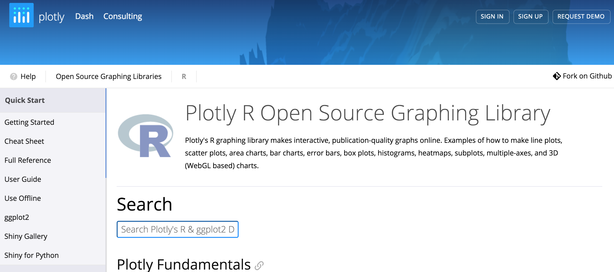
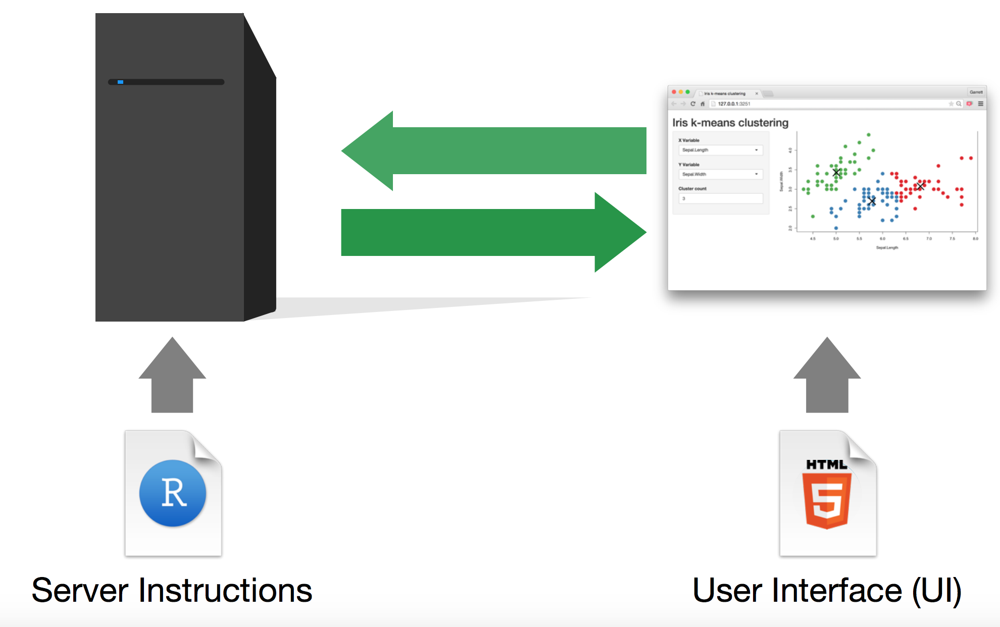
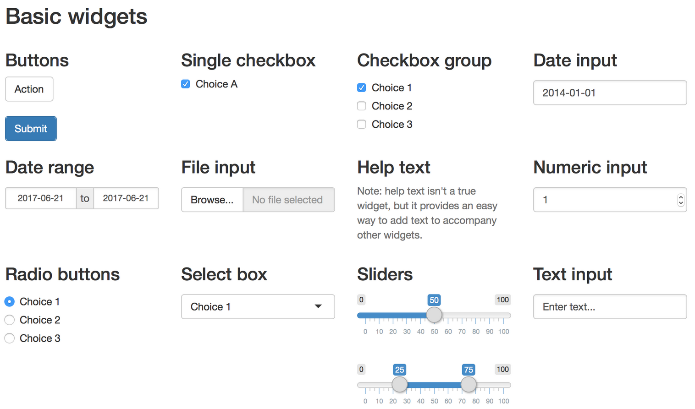
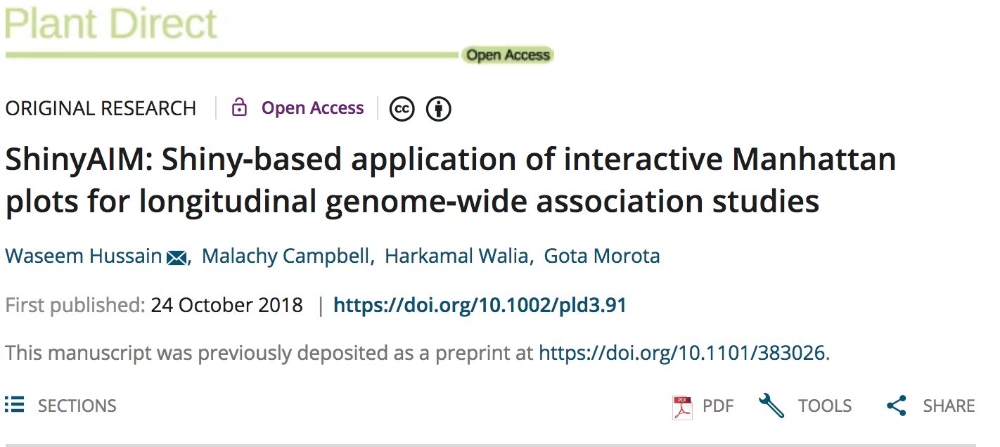

```{r setup, include=FALSE}
options(htmltools.dir.version = FALSE)

library(plotly)
library(tidyverse)
library(htmlwidgets)
```


# Interactive visualization in a nutshell
Example 
[Collision Detection](https://bl.ocks.org/mbostock/raw/3231298/)


---
class: small, left, top
## Why Interactive Visualization?

Interactivity allows users to
  
* ####Focus on detail:

  * Select and Zoom into a visualization
  * Hover over to get the exact information

* ####Enhance User experience:

  * Provide a tool for viewers to explore your data
  * User can actively select areas of interest in a chart
  * Users can get a summary of the relevant data

* ####Pose multiple questions:

    * Switch axes or to add confabulating factors
    * Break down responses to a specific question

.footnote[Martin Hadley, 3 benefits of interactive visualization, https://campus.sagepub.com/blog/3-benefits-of-interactive-visualization]


---
# Plotly R graphing library 

[https://plot.ly/r/](https://plot.ly/r/)


---
class: small, left, top
## Why Interactive Visualization?

#### Interactivity allows users to focus on detail:

  * Select and Zoom into a visualization
  * Hover over to get the exact information

.footnote[Martin Hadley, 3 benefits of interactive visualization, https://campus.sagepub.com/blog/3-benefits-of-interactive-visualization]


---
# Scatter Plots 
<iframe src="p1.html" width="100%" height="540" id="igraph" scrolling="no" seamless="seamless" frameBorder="0"> </iframe>
[https://plot.ly/r/line-and-scatter/](https://plot.ly/r/line-and-scatter/)

---
# Scatter and Line Plots 
<iframe src="p2.html" width="100%" height="540" id="igraph" scrolling="no" seamless="seamless" frameBorder="0"> </iframe>
[https://plot.ly/r/line-and-scatter/](https://plot.ly/r/line-and-scatter/)

---
# Cumulative Lines Animation 
<iframe src="p3.html" width="100%" height="540" id="igraph" scrolling="no" seamless="seamless" frameBorder="0"> </iframe>
[https://plot.ly/r/cumulative-animations/](https://plot.ly/r/cumulative-animations/)


---
class: small, left, top
## Why Interactive Visualization?

#### Interactivity allows enhanced user experience:

  * Provide a tool for viewers to explore your data

  * User can actively select areas of interest in a chart

  * Users can get a summary of the relevant data

.footnote[Martin Hadley, 3 benefits of interactive visualization, https://campus.sagepub.com/blog/3-benefits-of-interactive-visualization]


---
# Basic Range Slider and Selector Buttons
<iframe src="p4.html" width="100%" height="540" id="igraph" scrolling="no" seamless="seamless" frameBorder="0"> </iframe>
[https://plot.ly/r/range-slider/](https://plot.ly/r/range-slider/)


---
# Mulitple Slider Controls
<iframe src="p5.html" width="100%" height="540" id="igraph" scrolling="no" seamless="seamless" frameBorder="0"> </iframe>
[https://plot.ly/r/range-slider/](https://plot.ly/r/range-slider/)


---
class: small, left, top
## Why Interactive Visualization?

#### Interactivity allows users to pose multiple questions:

* Switch axes or to add confabulating factors

* Break down responses to a specific question

.footnote[Martin Hadley, 3 benefits of interactive visualization, https://campus.sagepub.com/blog/3-benefits-of-interactive-visualization]


---
# 3D Scatter Plots
<iframe src="p3dscat.html" width="100%" height="540" id="igraph" scrolling="no" seamless="seamless" frameBorder="0"> </iframe>


---
# Grouped Box Plots
<iframe src="p6.html" width="100%" height="540" id="igraph" scrolling="no" seamless="seamless" frameBorder="0"> </iframe>
[https://plot.ly/r/box-plots/](https://plot.ly/r/box-plots/)


---
# Correlation Map
<iframe src="p7.html" width="100%" height="540" id="igraph" scrolling="no" seamless="seamless" frameBorder="0"> </iframe>
[https://plot.ly/~smysona/8/correlation-map/#/](https://plot.ly/~smysona/8/correlation-map/#/)


---
# Shiny - [https://shiny.rstudio.com/](https://shiny.rstudio.com/)

- A web application framework for **interactive** visualization

- Able to generate user friendly web interfaces 

- Built on a reactive programming model

- Entirely extensible 
   - custom inputs and outputs
   - CSS themes
   - JavaScript and D3.js

- Example - [Collision Detection](https://bl.ocks.org/mbostock/raw/3231298/)

---

# Shiny framework 


**Template**
```{r eval=FALSE, tidy=FALSE}
library(shiny)

ui <- fluidPage()
server <- function(input, output) {}

shinyApp(ui = ui, server = server)
```


---

# Control widgets 

.left[[RStudio](https://shiny.rstudio.com/tutorial/written-tutorial/lesson3/)]


---
class: inverse, left, middle

# ShinyAIM - Shiny‐based application of interactive Manhattan plots

Can be used for 

- can explore GWAS peaks _interactively_

- _interactive_ exploration of Manhattan plots for longitudinal genome‐wide association studies (GWAS)

- no knowlege of R, HTML, JavaScript, or CSS is required. R code encapsulated as a web-based Shiny application


Available at [https://chikudaisei.shinyapps.io/shinyaim/](https://chikudaisei.shinyapps.io/shinyaim/) and [https://github.com/whussain2/ShinyAIM](https://github.com/whussain2/ShinyAIM)


---
# ShinyAIM Paper


[https://doi.org/10.1002/pld3.91](https://doi.org/10.1002/pld3.91)


---
# Summary

- data visualization plays a crucial role in summarizing and identifying the characteristics of data

- however, big data prevent the plotting of the entire picture 

- interactive visualization, with capabilities to zoom in and out, can help investigate both global and local structures of graphs


