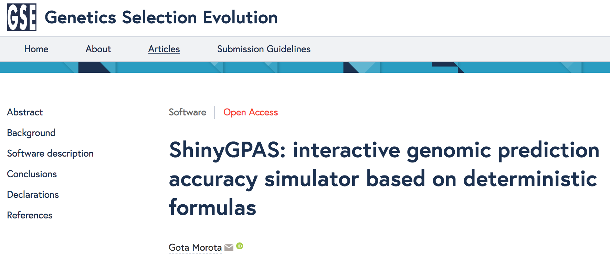

```{r setup, include=FALSE}
options(htmltools.dir.version = FALSE)
```


# Shiny - [https://shiny.rstudio.com/](https://shiny.rstudio.com/)

- A web application framework for **interactive** visualization

- Able to generate user friendly web interfaces 

- Built on a reactive programming model

- Entirely extensible 
   - custom inputs and outputs
   - CSS themes
   - JavaScript and D3.js

- Example - [Collision Detection](https://bl.ocks.org/mbostock/raw/3231298/)

---

# Shiny framework 


**Template**
```{r eval=FALSE, tidy=FALSE}
library(shiny)

ui <- fluidPage()
server <- function(input, output) {}

shinyApp(ui = ui, server = server)
```


---

# Control widgets 

.left[[RStudio](https://shiny.rstudio.com/tutorial/written-tutorial/lesson3/)]

---

# Shiny examples

Histogram
* Run ex1.R


Table
* Run ex2.R


---
# Cross-validation for genomic prediction
<div align="center">

</div>
.right[[doi:10.1093/jas/sky014](http://dx.doi.org/10.1093/jas/sky014)]


---

# Deterministic genomic prediction formulas

-  highlight the relationships among prediction accuracy and potential factors influencing prediction accuracy

- no computationally intensive cross-validation


1)  **Population parameter-based deterministic formulas**

- genotypes of individuals are not required 

2)  **Relationship-based deterministic formulas**

- genotypes of individuals need to be known


---
class: inverse, left, middle

# ShinyGPAS - Shiny Genomic Prediction Accuracy Simulator

Can be used for 
- _interactive_ exploration of potential factors influencing prediction accuracy 

- simulation of achievable prediction accuracy 
   - prior to genotyping individuals or performing CV
   
- supporting in-class teaching

- no knowlege of R, HTML, JavaScript, or CSS is required. R code encapsulated as a web-based Shiny application


Available at [https://chikudaisei.shinyapps.io/shinygpas/](https://chikudaisei.shinyapps.io/shinygpas/) and [https://github.com/morota/ShinyGPAS](https://github.com/morota/ShinyGPAS)


---
class: inverse, center, middle

# Population parameter-based deterministic formulas


---

# Deterministic formula (1)
Daetwyler et al. (2008; 2010)
\begin{align}
r &= \sqrt{\frac{N h^2}{N h^2 + M_e} }
\end{align}
where $N$ is the number of individuals in the reference population, $h^2$ is the heritability, and $M_e$ is the number of independent chromosome segments.

- treating genetic markers as fixed

- independence of quantitative trait loci (QTL)

- regression of phenotypes on genotype one locus at a time 

- $\sigma^2_{\epsilon}$ and $\sigma^2_g + \sigma^2_{\epsilon}=1$

- identical accuracy of QTL effect size estimates across QTL allele frequencies

- perfect linkage disequilibrium (LD) between marker and QTL pairs

- unrelated individuals


---

# Deterministic formula (2)
Goddard (2009)
\begin{align}
r &= \sqrt{1 - \frac{\lambda}{2N\sqrt{\alpha}} \ln\left( \frac{1 + \alpha + 2\sqrt{\alpha}}{1 + \alpha - 2\sqrt{\alpha}}\right) }
\end{align}
where $\lambda$ is $M_e/(h^2\ln(2N_e))$ and $\alpha$ is $1 + 2(M_e/Nh^2\ln(2N_e))$


- treating markers as random

- assuming complete LD between marker and QTL pairs

- QTL effects were assumed to be sampled from a normal distribution

- assumes that QTL with high minor allele frequencies have more accurate effect size than QTL with low minor allele frequencies


---

# Deterministic formula (3)
Goddard et al. (2011)
\begin{align}
r &= \sqrt{b \frac{Nbh^2/M_e}{1 + Nbh^2/M_e}}
\end{align}
where $b = M/(M + M_e)$  is the proportion of genetic variance explained by the markers and $M$ is the is the number of markers. 

- accounts for incomplete LD between markers and QTL


---

# Deterministic formula (4)
Rabier et al. (2016)
\begin{align*}
r &= \sqrt{\frac{h^2/(1-h^2)}{M_e/N + h^2/(1-h^2)}}.
\end{align*}

- relaxing the assumption of $\sigma^2_{\epsilon}$ and $\sigma^2_g + \sigma^2_{\epsilon}=1$

- can be applied with any value of $\sigma^2_{\epsilon}$ and $\sigma^2_g$


---

# Deterministic formula (5)
Rabier et al. (2016)
\begin{align*}
r &= \sqrt{\frac{h^2/(1-h^2)}{\mathbb{E}(||\mathbf{x}'_{n_{\text{TRN} + 1}} \mathbf{X}'\mathbf{V}^{-1} ||^2)  + h^2/(1-h^2)}}
\end{align*}
$M_e/N$ is equal to $\mathbb{E}(||\mathbf{x}'_{n_{\text{TRN} + 1}} \mathbf{X}'\mathbf{V}^{-1} ||^2)$ under RRBLUP.  

- $\mathbf{x}'_{n_{\text{TRN} + 1}}$ is the vector of markers belonging to the testing set individual
- $\mathbf{X}$ is the training set allele content matrix 
- $\mathbf{V} = \mathbf{X}\mathbf{X}' + \lambda \mathbf{I}$ 
- $\lambda$ is the regularization parameter 
- $||.||^2$ is the squared norm

Note that if we can assume individuals in training and testing sets were sampled from the same population, 
$\hat{\mathbb{E}}(||\mathbf{x}'_{n_{\text{TRN} + 1}} \mathbf{X}'\mathbf{V}^{-1} ||^2) \le 1$ 


---

# Deterministic formula (6)
de los Campos et al. (2013)

Under the genomic best linear unbiased prediction framework
\begin{align}
r &= \sqrt{ [1 - (1 - b)^2] h^2 }
\end{align}

- assuming that the patterns of allele sharing between markers and causal loci are different 

- $b$ is the average regression coefficient of the marker-based genomic relationships on genomic relationships at QTL


---

# Deterministic formula (7)
- Karaman et al. (2016)
\begin{align}
r &=  \sqrt{ h^2_M \left[ \frac{N h^2_M}{N h^2_M + M_e}  \right] }
\end{align}


- correlation between phenotypes and estimated breeding values (additive genetic values)

- $h^2_M$ is the genomic heritability, which is the proportion of phenotypic variance that is explained by regression on markers.


---

# Deterministic formula (8)

- Wientjes et al. (2016)
\begin{align}
r = \sqrt{ \begin{bmatrix} b_{AC} r_{G_{AC}} \sqrt{\frac{h^2_A}{M_{e_{A,C}}}  } & b_{BC} r_{G_{BC}} \sqrt{\frac{h^2_B}{M_{e_{B,C}}}} \end{bmatrix} \begin{bmatrix} \frac{h^2_A}{M_{e_{A,C}}} + \frac{1}{N_A} & r_{G_{AB}} \sqrt{\frac{h^2_A h^2_B}{M_{e_{A,C}} M_{e_{B,C}} }   } \\ r_{G_{AB}} \sqrt{\frac{h^2_A h^2_B}{M_{e_{A,C}} M_{e_{B,C}} }   } &  \frac{h^2_B}{M_{e_{B,C}}} + \frac{1}{N_B} \end{bmatrix}^{-1} } \\
\times \sqrt{\begin{bmatrix} b_{AC} r_{G_{AC}} \sqrt{\frac{h^2_A}{M_{e_{A,C}}}} \\ b_{BC} r_{G_{BC}} \sqrt{\frac{h^2_B}{M_{e_{B,C}}}} \end{bmatrix}}
\end{align}

Combines two populations A and B to predict prediction accuracy in population C.

- $b_{AC}$ is the square root of the proportion of the genetic variance in predicted population C explained by the markers in training population A
- $r_{G_{AC}}$ is the genetic correlation between populations A and C
- $M_{e_{A,C}}$ is the effective number of chromosome segments shared between populations A and C


---

# Paper


[doi:10.1186/s12711-017-0368-4](https://doi.org/10.1186/s12711-017-0368-4)


---
class: inverse, center, middle

# Relationship-based deterministic formulas


---
## Relationship-based deterministic formula (1)

* use genotypes of selection candidates and reference individuals
* accounts for family structures

[VanRaden (2008)](https://doi.org/10.3168/jds.2007-0980) - selection index theory
* accuracy of genomic prediction for each testing set individual (rather than the entire testing set individuals as seen in the population-parameter deterministic formuals)

\begin{align}
r &= \sqrt{ \mathbf{c} \left [ \mathbf{G} + \mathbf{I} \frac{\sigma^2_{\epsilon}}{\sigma^2_g}  \right ]^{-1} \mathbf{c}' }
\end{align}

- $\mathbf{c}$ is a vector of genomic relationships between the testing set individual and the reference population
- $\mathbf{G}$ is the genomic relationships among the reference population individuals


---
## Relationship-based deterministic formula (2)

[Wientjes et al. (2015)](https://doi.org/10.1186/s12711-014-0086-0) - extended to across-population genomic prediction 
* predict an individual in population C from populations A and B

\begin{align}
r = \sqrt{ \begin{bmatrix} r_{G_{AC}}\mathbf{c}_{AC} &  r_{G_{BC}}\mathbf{c}_{BC}  \end{bmatrix} \begin{bmatrix} \mathbf{G}_A + \mathbf{I}_A\frac{\sigma^2_{e_{a}}}{\sigma^2_{g_{a}}} & r_{G_{AB}}\mathbf{c}_{AB} \\ r_{G_{AB}}\mathbf{c}_{AB}' &  \mathbf{G}_B + \mathbf{I}_B\frac{\sigma^2_{e_{b}}}{\sigma^2_{g_{b}}} \end{bmatrix}^{-1} } \\
\times \sqrt{ \begin{bmatrix} r_{G_{AC}}\mathbf{c}_{AC}' \\ r_{G_{BC}}\mathbf{c}_{BC}' \end{bmatrix}}
\end{align}


* predict an individual in population C from population A 

\begin{align}
r &= \sqrt{ r_{G_{AC}}\mathbf{c}_{AC} \left [ \mathbf{G}_{A} + \mathbf{I}_{A} \frac{\sigma^2_{e_{a}}}{\sigma^2_{g_{a}}}  \right ] r_{G_{AC}}\mathbf{c}_{AC}' }
\end{align}

- 


