```{r setup, include=FALSE}
options(htmltools.dir.version = FALSE)

library(plotly)
library(tidyverse)
library(htmlwidgets)
```


# Multivariate traits


- Multi-trait GWAS (MTM-GWAS)

- Structural equation model GWAS (SEM-GWAS)


---
# Multi-trait model 
$$
\begin{align*}
  \mathbf{y} &= \mathbf{Xb} + \mathbf{Zu} + \mathbf{e}  \\
  \begin{bmatrix}
    \mathbf{y_1} \\
    \mathbf{y_2} \\
    \vdots \\
    \mathbf{y_n} \\
  \end{bmatrix} &=
  \begin{bmatrix}
    \mathbf{X_1} & 0 & \cdots & 0 \\
    0 & \mathbf{X_2} & \cdots  & 0\\
    \vdots & \vdots &  & \vdots \\
    0 & 0 & \cdots  & \mathbf{X_n} \\
  \end{bmatrix} 
  \begin{bmatrix}
    \mathbf{b_1} \\
    \mathbf{b_2} \\
    \vdots \\
    \mathbf{b_n} 
  \end{bmatrix} \\ &+
  \begin{bmatrix}
    \mathbf{Z_1} & 0 & \cdots & 0 \\
    0 & \mathbf{Z_2} & \cdots  & 0\\
    \vdots & \vdots &  & \vdots \\
    0 & 0 & \cdots  & \mathbf{Z_n} \\
  \end{bmatrix}
  \begin{bmatrix}
    \mathbf{u_1} \\
    \mathbf{u_2} \\
    \vdots \\
    \mathbf{u_n} 
  \end{bmatrix} +
  \begin{bmatrix}
    \mathbf{e_1} \\
    \mathbf{e_2} \\
    \vdots \\
    \mathbf{e_n} 
  \end{bmatrix} \\
   E\begin{pmatrix}
  \mathbf{u} \\
  \mathbf{e}
  \end{pmatrix} &=
  \begin{bmatrix}
    0 \\
    0
  \end{bmatrix} \\
  Var\begin{pmatrix}
  \mathbf{u} \\
  \mathbf{e}
  \end{pmatrix} &=
  \begin{bmatrix}
    \mathbf{\Sigma^2_{g}} \otimes \mathbf{G} & 0 \\
    0 & \mathbf{\Sigma^2_e} \otimes \mathbf{I}
  \end{bmatrix}
\end{align*}
$$


---
# Multi-trait model (t = 2)
$$
\begin{align*}
\mathbf{\Sigma^2_{g}} &=
  \begin{bmatrix}
    \mathbf{\Sigma^2_{g_{1}}}  & \mathbf{\Sigma^2_{g_{12}}} \\
    \mathbf{\Sigma^2_{g_{21}}} & \mathbf{\Sigma^2_{g_{2}}} 
  \end{bmatrix} \\
  \mathbf{\Sigma^2_{e}} &=
  \begin{bmatrix}
    \mathbf{\Sigma^2_{e_{1}}}  & \mathbf{\Sigma^2_{e_{12}}} \\
    \mathbf{\Sigma^2_{e_{21}}} & \mathbf{\Sigma^2_{e_{2}}} 
  \end{bmatrix} \\
  \mathbf{\Sigma^2_{g}} \otimes \mathbf{G} &= 
  \begin{bmatrix}
    \mathbf{\Sigma^2_{g_{1}}} \mathbf{G}  & \mathbf{\Sigma^2_{g_{12}}} \mathbf{G}  \\
    \mathbf{\Sigma^2_{g_{21}}} \mathbf{G}  & \mathbf{\Sigma^2_{g_{2}}}  \mathbf{G} 
  \end{bmatrix} \\
   \mathbf{\Sigma^2_{e}} \otimes \mathbf{I} &= 
  \begin{bmatrix}
    \mathbf{\Sigma^2_{e_{1}}} \mathbf{I}  & \mathbf{\Sigma^2_{e_{12}}} \mathbf{I}  \\
    \mathbf{\Sigma^2_{e_{21}}} \mathbf{I}  & \mathbf{\Sigma^2_{e_{2}}}  \mathbf{I} 
  \end{bmatrix} \\
\end{align*}
$$


---
# Multi-trait model (t = 2)
The MME model is
$$
\begin{align*}
  \begin{bmatrix}
    \mathbf{X'R_0^{-1}X} &  \mathbf{X'R_0^{-1}Z} \\
    \mathbf{Z'R_0^{-1}X} &  \mathbf{Z'R_0^{-1}Z} + \mathbf{G_0}^{-1} \\
  \end{bmatrix}
  \begin{bmatrix}
    \mathbf{b} \\
    \mathbf{u}
  \end{bmatrix} &= 
  \begin{bmatrix}
    \mathbf{X'R_0^{-1}y} \\
    \mathbf{Z'R_0^{-1}y} 
  \end{bmatrix} \\
  \mathbf{G_0}^{-1} &= (\mathbf{\Sigma^2_{g}} \otimes \mathbf{G})^{-1} \\
  &= \mathbf{\Sigma^2_{g}}^{-1} \otimes \mathbf{G}^{-1} \\
  \mathbf{R_0}^{-1} &= (\mathbf{\Sigma^2_{e}} \otimes \mathbf{I})^{-1} \\
    &= {\mathbf{\Sigma^2_{e}}}^{-1} \otimes \mathbf{I}^{-1} 
\end{align*}
$$

---
# Multi-trait GBLUP model 
$$\mathbf{y_{1} = X_{1}b_{1} + Z_{1}u_{1} + e_{1}}$$
$$\mathbf{y_{2} = X_{2}b_{2} + Z_{2}u_{2} + e_{2}}$$


Individuals within traits 
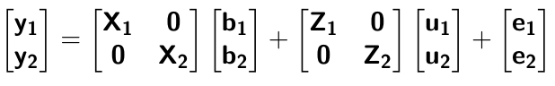


---
# Multi-trait RR-BLUP model 
$$\mathbf{y_{1} = X_{1}b_{1} + W_{1}a_{1} + e_{1}}$$
$$\mathbf{y_{2} = X_{2}b_{2} + W_{2}a_{2} + e_{2}}$$


Individuals within traits 
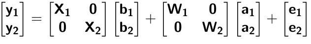
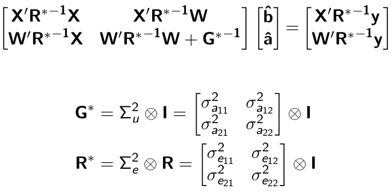


---
# Is multi-trait model useful?

GBLUP model

- estimate covariance structures $\rightarrow$ genetic correlations

- traits with scarce records 

- traits with low heritability

RR-BLUP

- increase statistical power to detect QTL regions 


---
# MTM-GWAS


---
# Multiple-trait GWAS (MTM-GWAS)


---
# Interrelationships among traits 


1. Biological prior 
    - previous experiments
    - literature

2. Infer from the data


---
# Phenotypic,  genetic, and residual networks


---
# Leveraging phenotypic networks to study multiple traits
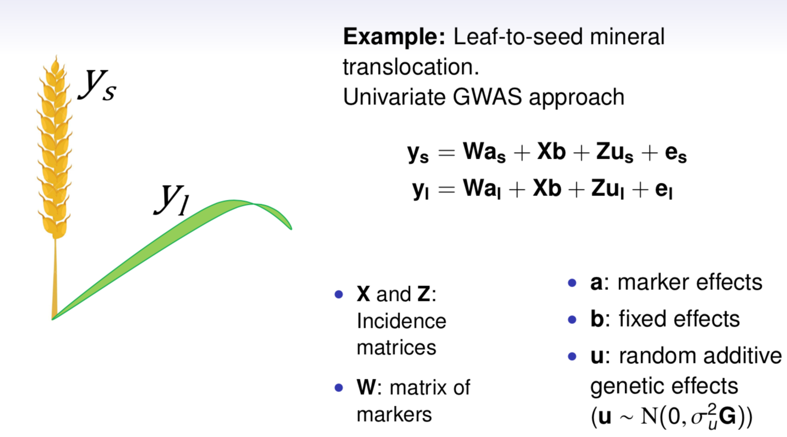


---
# Leveraging phenotypic networks to study multiple traits
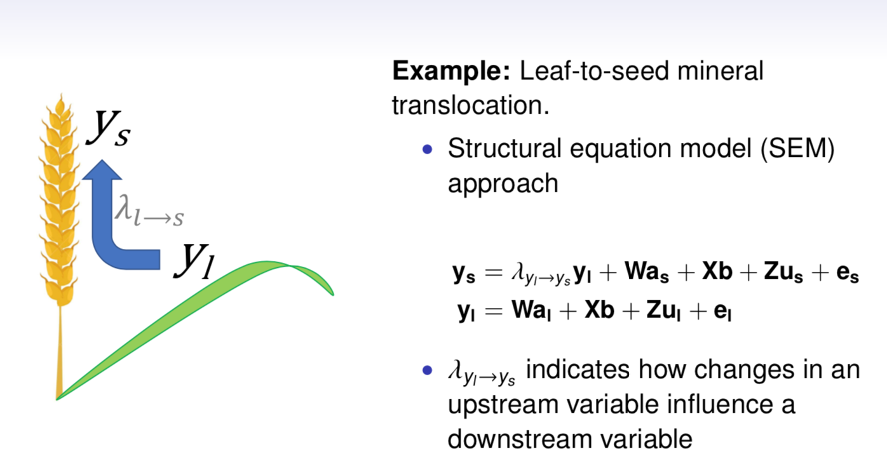


---
# Introducing SEM into the GWAS framework
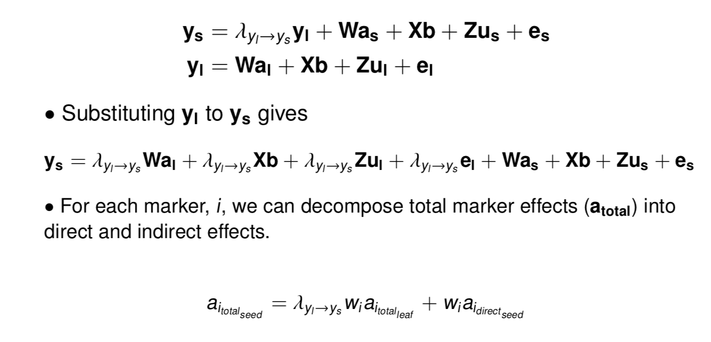


---
# Structural equation model GWAS (SEM-GWAS)
Direct effect of SNP on Trait 4

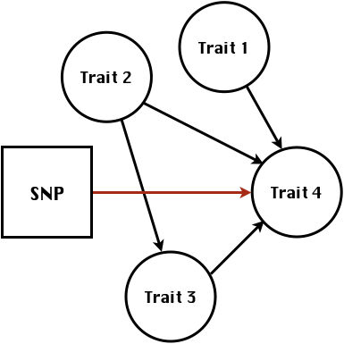

---
# SEM-GWAS
Indirect effect of SNP on Trait 4 through Trait 1 (1)

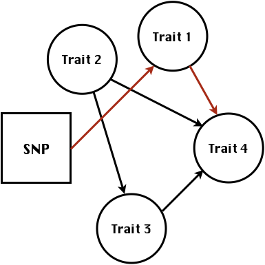


---
# SEM-GWAS
Indirect effect of SNP on Trait 4 through Trait 2 (2)

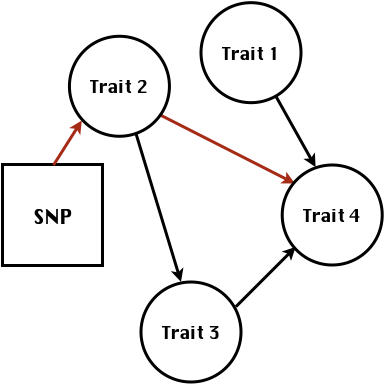


---
# SEM-GWAS
Indirect effect of SNP on Trait 4 through Trait 2 & 3 (3)

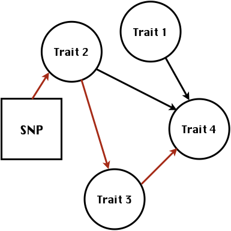


---
# SEM-GWAS
Indirect effect of SNP on Trait 4 through Trait 3 (4)


---
# SEM-GWAS vs. MTM-GWAS
Effect of SNP on Trait 4

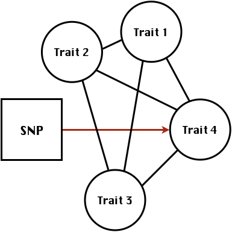


\begin{align*}
     \text{Effect of SNP (MTM-GWAS)} &\approx \text{Overall effect (SEM-GWAS)}\\
     &= \text{Direct effect (SEM-GWAS)} \\
     &+ \text{Indirect effect (SEM-GWAS)} 
\end{align*}


---
# How to fit SEM-GWAS?

1. Fit MTM and decompose phenotypes into genetics and residuals

2. Infer the network structure of traits

3. Fit SEM-GWAS given the network structure


Example 1: Chicken data (n = 1,351),  Momen et al. (2018)

- breast muscle (BM)

- body weight (BW)

- hen-house egg production (HHP)


---
# Inferred network structure (1)
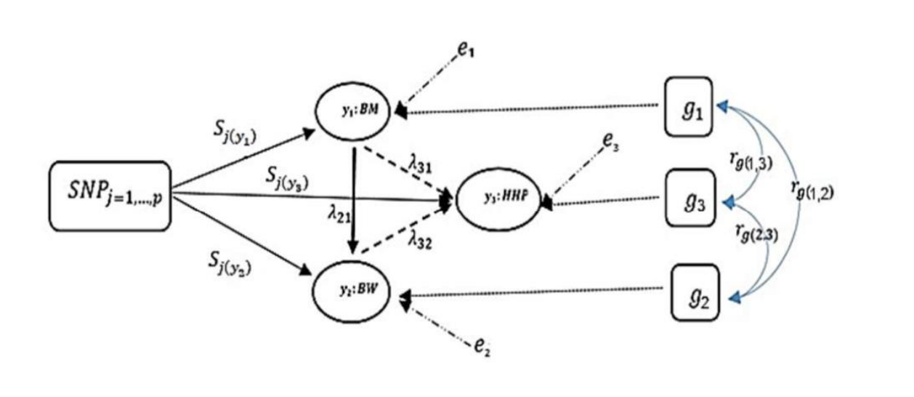

Structual equation model

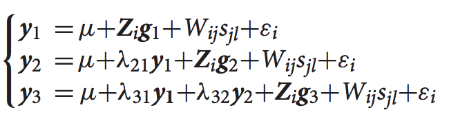


---
# Inferred network structure (2)


Structual equation model

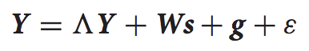
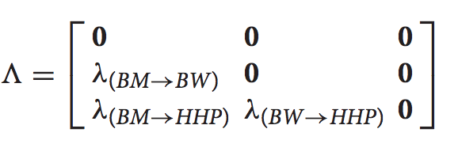


---
# Inferred network structure (3)


Decomposition of SNP effects 
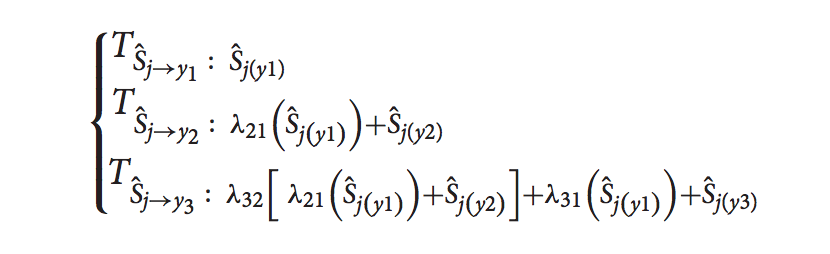


---
# Manhattan plots of BW (overall, direct, and indirect SNP effects)


---
# More details about Chicken SEM-GWAS
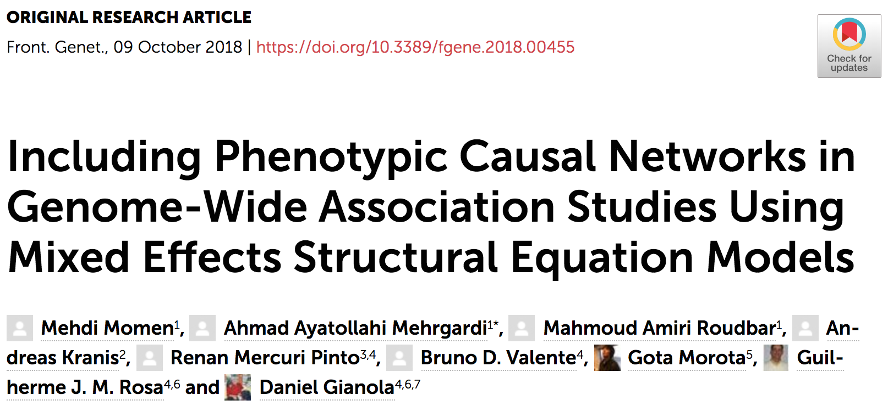


---
# Leveraging phenotypic networks to study multiple traits
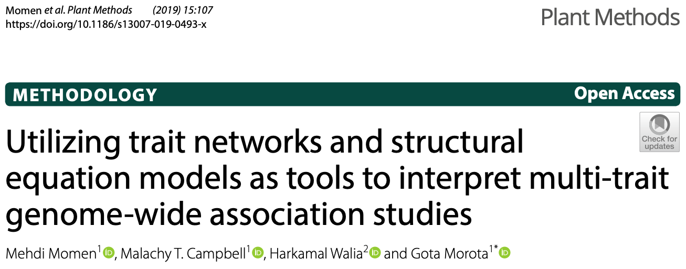

---
# Leveraging phenotypic networks to study multiple traits
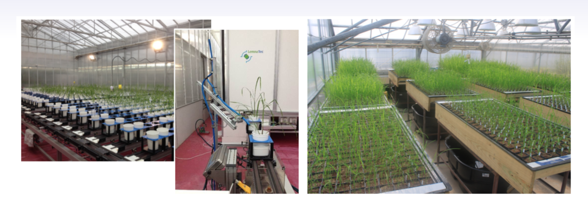

.pull-left[
- Shoot biomass (projected shoot area, PSA)
- Root biomass (RB)
]

.pull-right[
- Water use (WU)
- Water use efficiency (WUE)
]

How are these traits related?

---
# Rice data

- Drought data
- Rice diversity panel
    - Projected shoot area
    - Root biomass
    - Water use efficiency
    - Water use
  
Inferred trait network structure
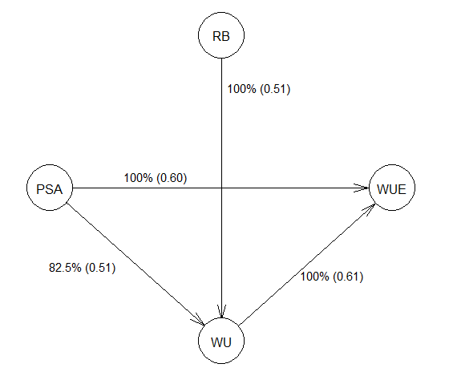


---
# Bayesian networks
.pull-left[
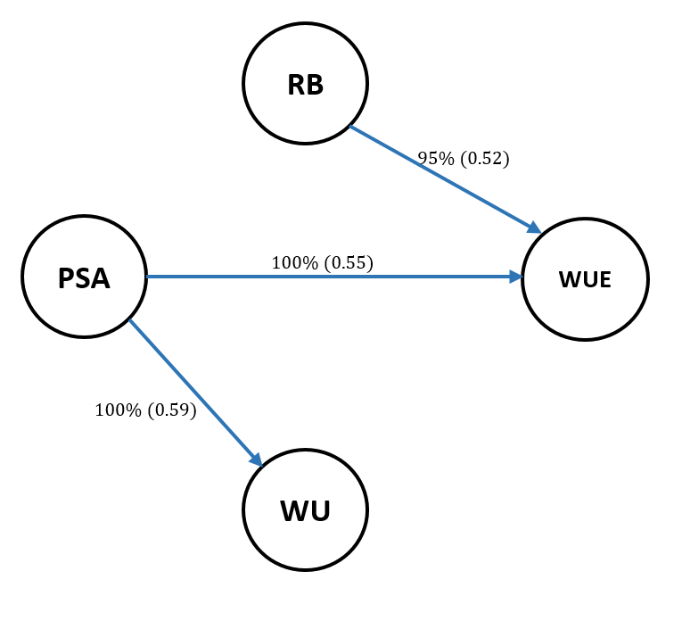
]

.pull-right[
- BN based on 500 bootstrap samples

- % above edges indicate percentage of bootstrap networks with the given edge

- Numbers in parenthesis indicate the proportion of bootstrap networks with the given edge direction
]


---
# Bayesian networks
.pull-left[

]

.pull-right[
- Phenotypic values for WUE are dependant on phenotypes for RB and PSA

- Phenotypic values for WU are dependant on phenotypes for PSA
]


---
# How to fit SEM-GWAS?
\begin{align*}
\mathbf{y} =\boldsymbol{\Lambda}  \mathbf{y} + \mathbf{ws} + \mathbf{Zg} + \boldsymbol{\epsilon}
\end{align*}


---
# Inferred trait network structure
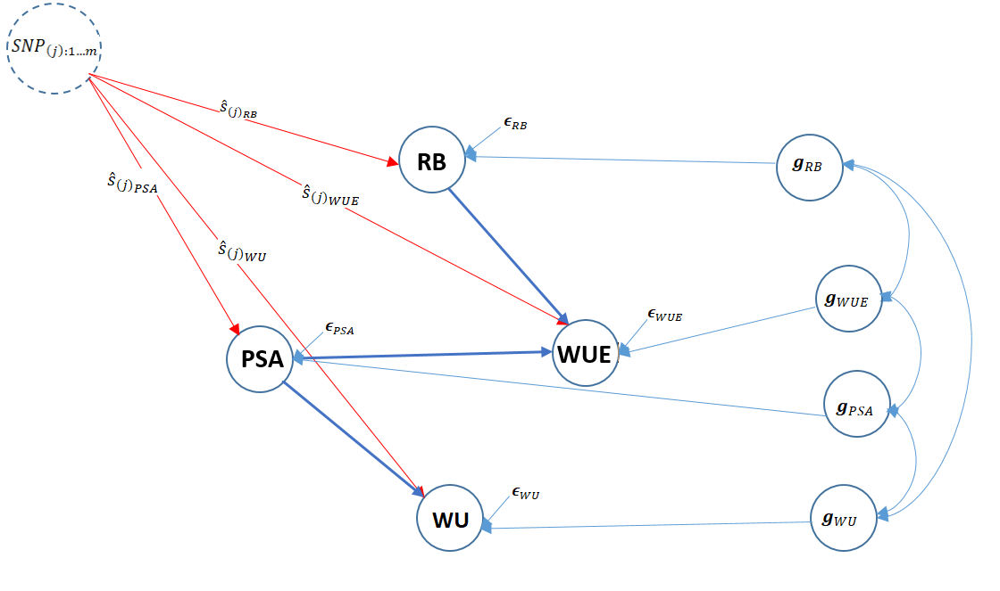


---
# Structural equation model
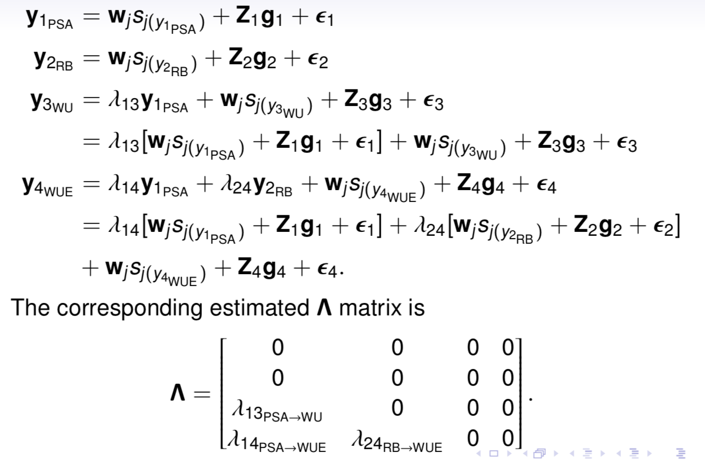


---
# Bayesian information criterion
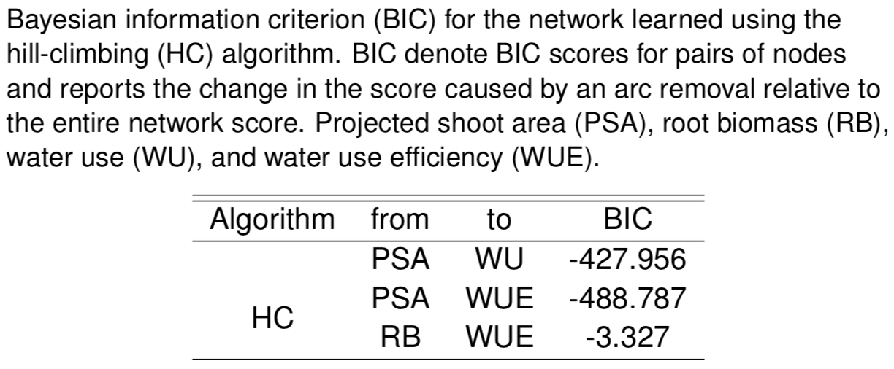

---
# Structural coefficients
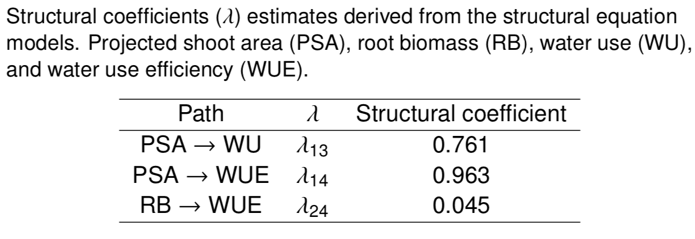


---
# Projected shoot area
\begin{align*}
\text{Direct}_{s_j \rightarrow y_{1_{\text{PSA}}}} &= s_{j(y_{1_{\text{PSA}}})} \\
\text{Total}_{s_j \rightarrow y_{1_{\text{PSA}}}} &= \text{Direct}_{s_j \rightarrow y_{1_{\text{PSA}}}}\\
&= s_{j(y_{1_{\text{PSA}}})}
\end{align*}

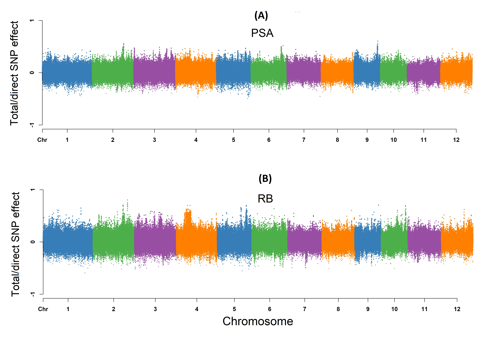


---
# Root biomass
\begin{align*}
\text{Direct}_{s_j \rightarrow y_{2_{\text{RB}}}} &=s_{j(y_{2_{\text{RB}}})} \\
\text{Total}_{s_j \rightarrow y_{2_{\text{RB}}}} &= \text{Direct}_{s_j \rightarrow y_{2_{\text{RB}}}}\\
&= s_{j(y_{2_{\text{RB}}})}
\end{align*}
  


---
# Water use
\begin{align*}
\text{Direct}_{s_j \rightarrow y_{3_{\text{WU}}}} &=s_{j(y_{3_{\text{WU}}})} \\
\text{Indirect}_{s_j \rightarrow y_{3_{\text{WU}}}} &= \lambda_{13}s_{j(y_{1_{\text{PSA}}})} \\
\text{Total}_{s_j \rightarrow y_{3_{\text{WU}}}} &= \text{Direct}_{s_j \rightarrow y_{3_{\text{WU}}}} + \text{Indirect}_{s_j \rightarrow y_{3_{\text{WU}}}} \\
&= s_{j(y_{3_{\text{WU}}})} + \lambda_{13}s_{j(y_{1_{\text{PSA}}})}
\end{align*}

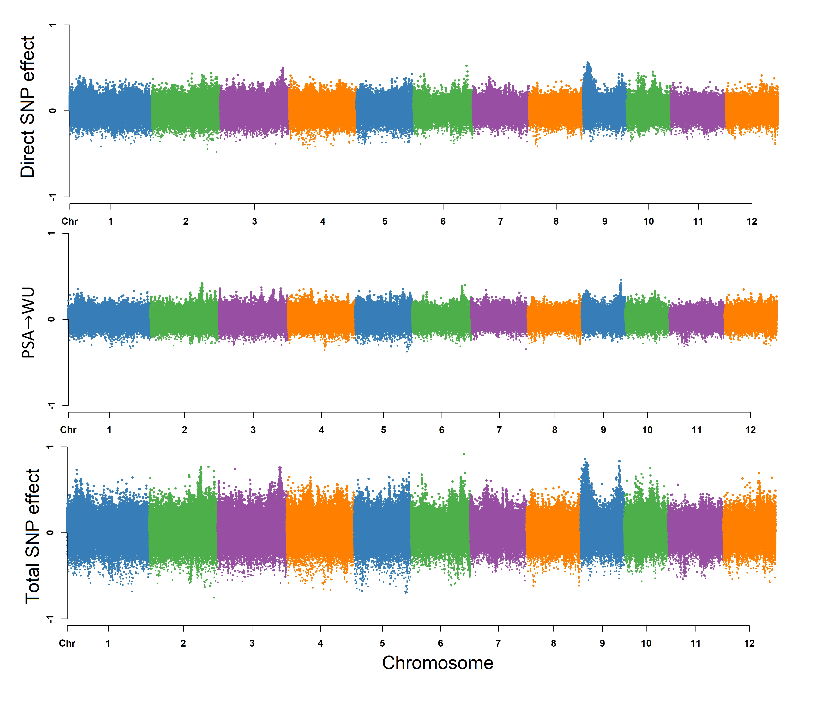


---
# Water use efficiency
\begin{align*}
\text{Direct}_{s_j \rightarrow y_{4_{\text{WUE}}}} &=s_{j(y_{4_{\text{WUE}}})} \\
\text{Indirect(1)}_{s_j \rightarrow y_{4_{\text{WUE}}}} &= \lambda_{14}s_{j(y_{1_{\text{PSA}}})} \\
\text{Indirect(2)}_{s_j \rightarrow y_{4_{\text{WUE}}}} &= \lambda_{24}s_{j(y_{2_{\text{RB}}})} \\
\text{Total}_{S_j \rightarrow y_{4_{\text{WUE}}}} &= \text{Direct}_{s_j \rightarrow y_{4_{\text{WUE}}}} + \text{Indirect(1)}_{s_j \rightarrow y_{4_{\text{WUE}}}} + \text{Indirect(2)}_{s_j \rightarrow y_{4_{\text{WUE}}}} \\ 
&= s_{j(y_{4_{\text{WUE}}})} + \lambda_{14}s_{j(y_{1_{\text{PSA}}})} + \lambda_{24}s_{j(y_{2_{\text{RB}}})}
\end{align*}


---
# Water use efficiency


---
# Ongoing SEM-GWAS projects

- Italian Brown Swiss cattle (University of Padua)
    - Milk yield
    
    - Milk pH
    
    - Milk lactose
    
    - Somatic cell score
    
    - Non-casein N
    
---
# Conclusions for SEM-GWAS
- Relatively simple approach to understand how QTL affect multiple traits

- Provides novel insights compared to conventional multi-trait GWAS approaches


