```{r setup, include=FALSE}
options(htmltools.dir.version = FALSE)

library(tidyverse)
library(htmlwidgets)
```


# Epistasis what is it?
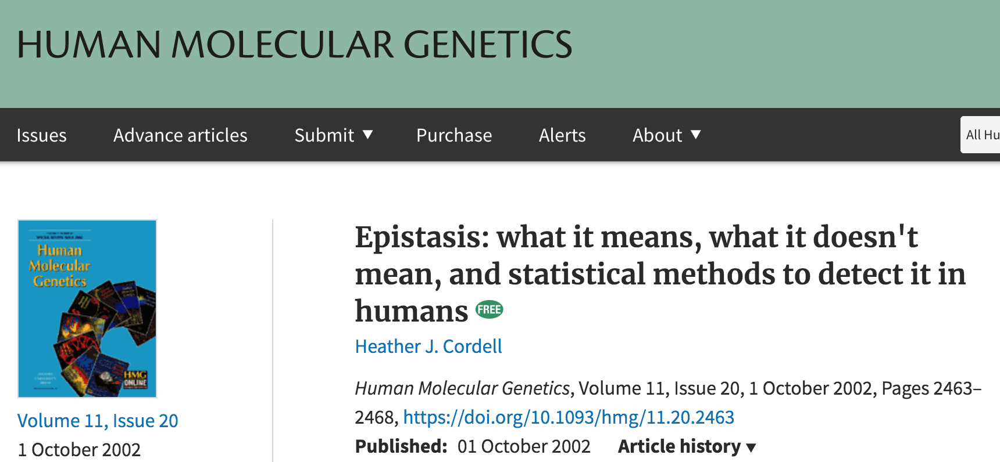


---
# How to parameterize response variable $\mathbf{y}$ ?
Example: 50,000 SNP panel 

- additive model 
    - 50K effects to estimate
- additive + dominance model 
    - 50K + 50K effects to estimate!
- additive + dominance  + second-order epistasis model 
    - 50K + 50K RV + ${50\text{K} \choose 2}$ effects to estimate


1. Overparameterization!!!!!

2. Curse of dimensionality


---
# Mean heterogeneity analysis
- mean value difference between genotypes
- average effect of allele substitution
- standard GWAS is designed to capture these genetic signals

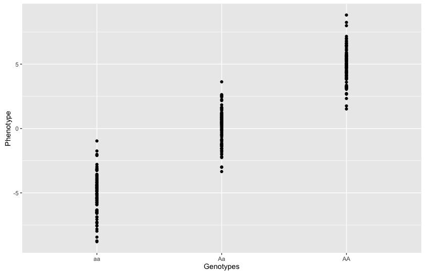


---
# Variance heterogeneity analysis
- heterogenity of variance between genotypes
- variance heterogeneity loci (vQTL) or variance GWAS
(vGWAS)
- standard GWAS is not able to capture these genetic signals

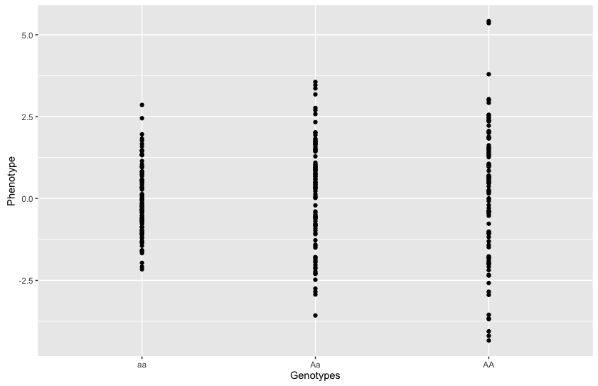


---
# Example: Variance heterogeneity locus
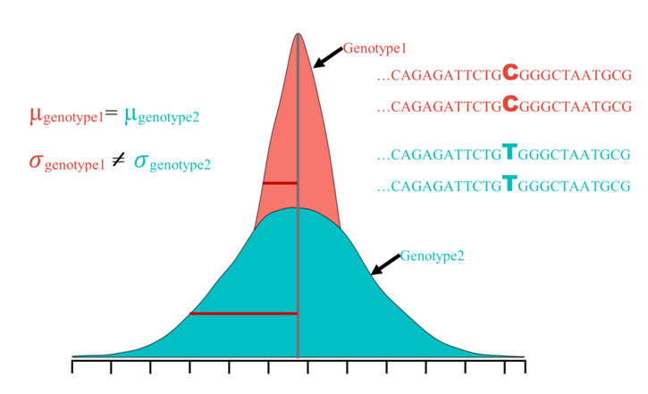


---
# Variance heterogeneity loci
Variance heterogeneity loci are potentially involved in
- buffer the impact of cryptic genetic variations
- release of hidden genetic variation
- developmental stability
- phenotypic plasticity


.pull-left[
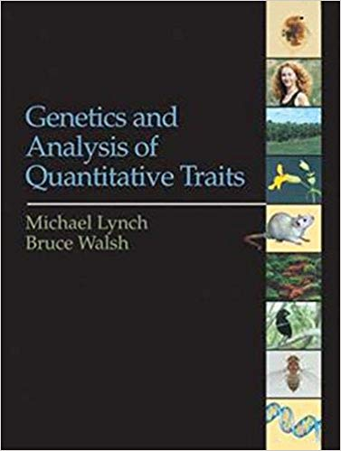
]


.pull-right[
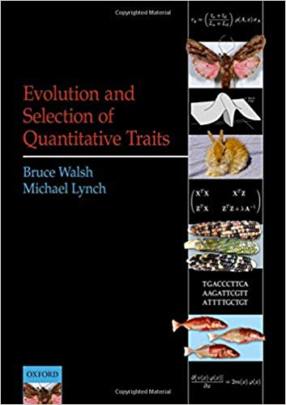
]

--

Epistasis


---
# Non-epistatic variance QTL vs. Epistatic variance QTL 
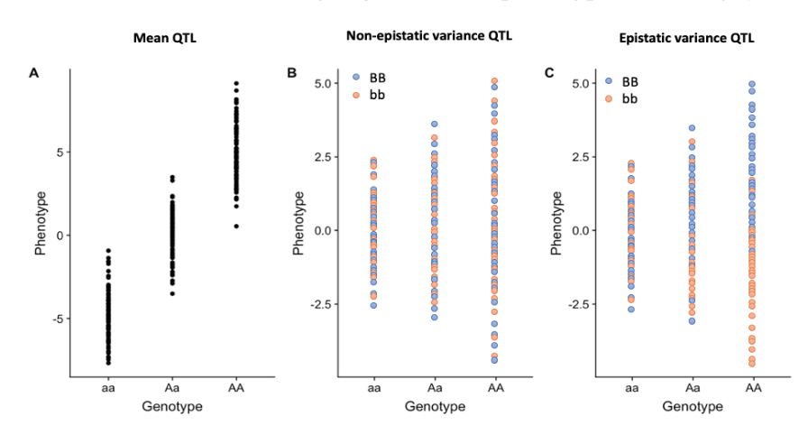


---
# Association mapping panel
- hard winter wheat association panel of 299 lines
- cadmium concentration
- 90,000 markers (Wang et al. 2014)

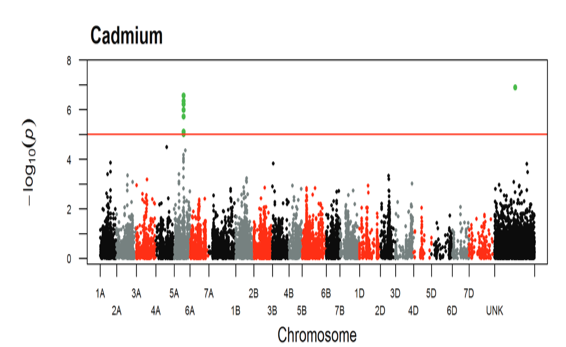

Guittieri et al., 2015

---
# Double generalized linear model (DGLM)
$$
\begin{align}
  \mathbf{y} &= \mathbf{1}\mu_m + \mathbf{X}\mathbf{b} +  \mathbf{S}_m a_m + \boldsymbol{\epsilon} \\
   \boldsymbol{\epsilon}_i  \sim& N(0, \sigma^{2}_{\epsilon_i}) \\\
    \log  (\sigma^2_{\epsilon_i}) &=   \mathbf{1}\mu_v + \mathbf{S}_v a_v. 
\end{align}
$$
- $\sigma^2_{\epsilon_{i}} \sim \frac{ \hat{\epsilon}_i^2 }{ 1 - h_{ii}}$ is fitted using  GLM of a gamma distribution with a log link function, where weights are provided by $\frac{1 - h_{ii}}{2}$ and a linear predictor equals to a single marker covariate $\mathbf{s}\mathbf{a}$. 

- equivalent to modeling  $\mathbf{y} \sim N(\mathbf{1}\mu_m + \mathbf{X}\mathbf{b} + \mathbf{S}_m a_m, \exp(\mathbf{1}\mu_v + \mathbf{S}_va_v) )$

- works in an iterative manner between the mean and variance parts of the model


---
# Hierarchical generalized linear model (HGLM)
$$
\begin{align}
  \mathbf{y} &= \mathbf{1}\mu_m + \mathbf{X}\mathbf{b} +  \mathbf{S}_m a_m +  \mathbf{Z}\mathbf{u} + \boldsymbol{\epsilon} 
\end{align}
$$


- $\mathbf{u} \sim N(0, G \sigma^2_g)$ is assumed to be a stochastic Gaussian process with mean zero and covariance function defined by a genomic relationship matrix $\mathbf{G}$ 

Variance GWAS
- equivalent to peforming vGWAS after adjusting for  potential covariates and mean-controlling effect

---
# Epistasis analysis
Pairwise interaction analyses for significant variance heterogenity markers 
$$
\begin{align*}
\mathbf{y} &= \mathbf{1}\mu +  \mathbf{X}\mathbf{b} +  \mathbf{S}_j\mathbf{a}_j + \mathbf{S}_k\mathbf{a}_k + ( \mathbf{S}_j \mathbf{S}_k)\nu_{jk} + \boldsymbol{\epsilon}
\end{align*}
$$

- $\mathbf{X}$ is the incident matrix for the first four PCs

- $S_j$ and $S_k$ are SNP codes for the jth and kth markers


---
# Results: Mean and variance GWAS


---
# Results: Variance GWAS loci
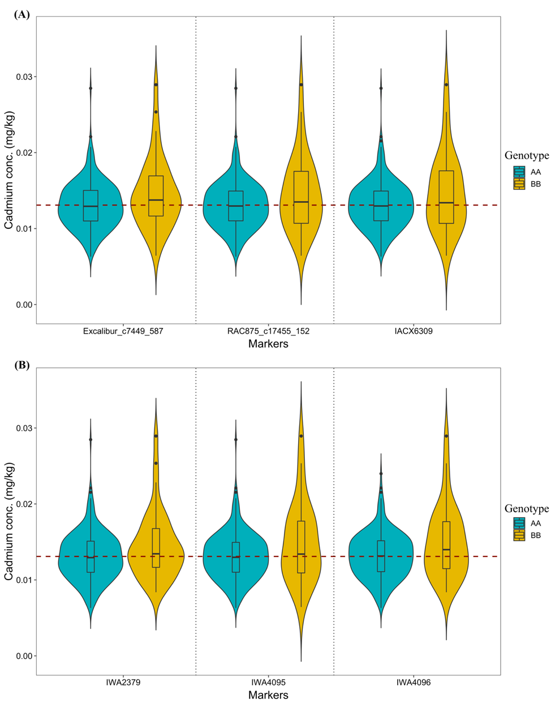

---
# Results: Epistasis analysis
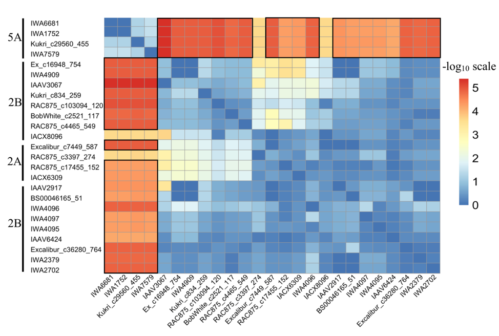

---
# Preprint
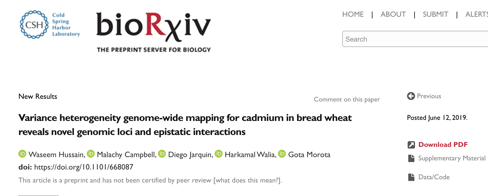


---
# Morota lab at Virginia Tech
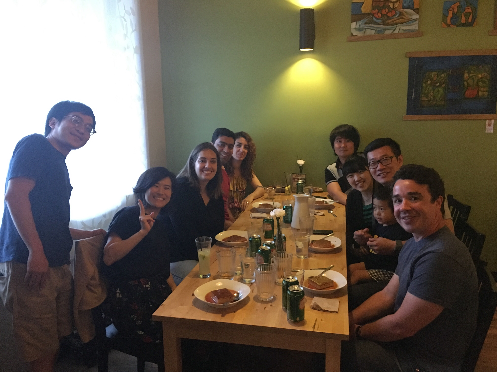


