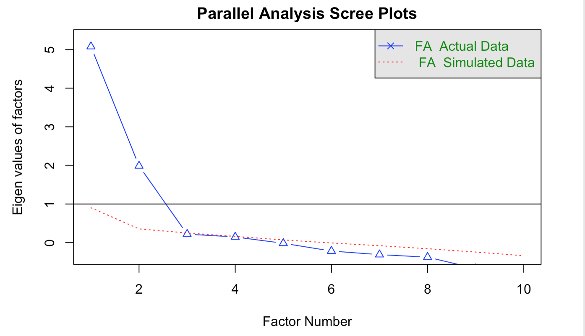
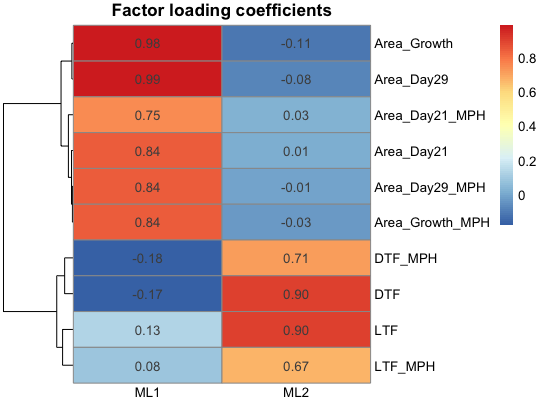
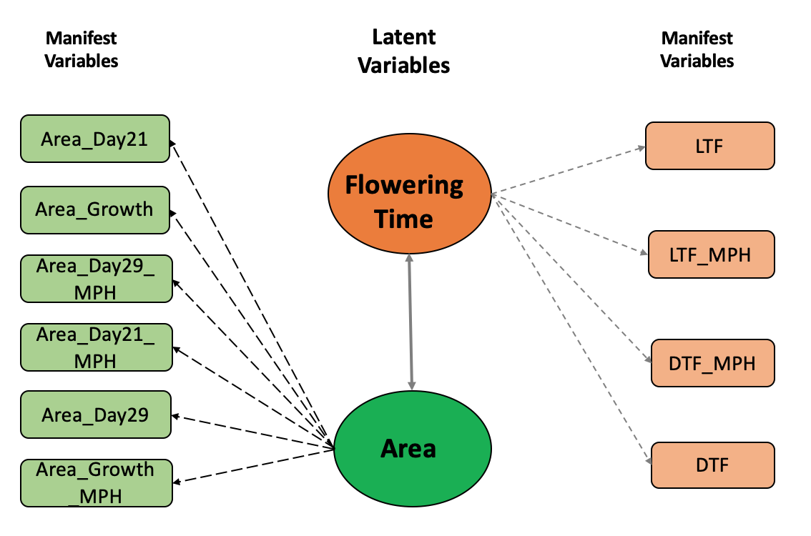

```{r setup, include=FALSE}
knitr::opts_chunk$set(echo = TRUE, warning = FALSE, message = FALSE)
```

This computer lab exercise was written by  [Haipeng Yu](https://haipengu.github.io/) and [Gota Morota](http://morotalab.org/). 

## Background
Phenotypes are often correlated because of pleiotropy or linkage disequilibrium of QTLs in the complex traits system. A multi-trait mixed model is prevalent in quantiative genetics because it can account for genetic or environmental covariances among phenotypes. Nevertheless, there is a concern of computational efficiency when the number of phenotypes is large, particularly when phenotypes are collected using high-throughput phenotyping platforms. 

One alternative approach is to use a factor analytic (FA) model. A FA model assumes that observed phenotypes are generated from underlying unobserved latent variables or factors. In this tutorial, we introduce two types of FA models: exploratory factor analysis (EFA) and confirmatory factor analysis (CFA). We selected ten phenotypes (Area_Day21, Area_Growth, Area_Day29_MPH, Area_Day21_MPH, Area_Day29, Area_Growth_MPH, LTF, LTF_MPH, DTF_MPH, and DTF) from a public Arabidopsis data [@seymour2016genetic] to illustrate how FA models can be fitted. The Arabidopsis data set used in this tutorial can be found in [easyGWAS](https://easygwas.ethz.ch/data/public/phenotypes/1/42/) (Arabidopsis thaliana -> F1 Hybrids Seymour et. al. 2016, PNAS). Alternatively, you can downloand the data set directly from [here](https://github.com/HaipengU/Data_file/tree/master/Arabidopsis_data).

## Load R packages
```{r}
library(blavaan)
library(pheatmap)
library(psych)
```

## Data import
```{r, eval=FALSE, echo=TRUE}
# import ten Arabidopsis phenotypes
pheno <- read.table('Arabidopsis.txt', header = TRUE)
dim(pheno) # 372  10
```

## Fit Exploratory Factor Analysis (EFA)
When there is no biological prior knowledge about the potential number of factors under the observed phenotypes, an exploratory factor analysis (EFA) could be exploited to search the underlying factors and the network structure between factors and phenotypes. Three steps have been implemented to fit the EFA: 1) identify the number of factors underlying observed phenotypes; 2) fit the EFA model using the number of factors detected in the first step; 3) initiate a clear network structure between factors and phenotypes using the factor loading coefficients derived from step 2.  

### Step1: explore the number of factors under the phenotypes
```{r, eval=FALSE, echo=TRUE}
# calculate phenotypic correlation between traits 
COR <- cor(pheno, use = "complete.obs")

# parallel analysis to identify underlying factors using phenotypic correlation
fa.parallel(COR, n.obs = 123, fa = "fa", n.iter = 100, error.bars = FALSE,
            se.bars = FALSE, ylabel = 'Eigen values of factors', fm = 'mle')
```

The general logic of parallel analysis is extracting the factors by comparing the eigenvalues of observed data and a data set simulated from observed data until observed data have a smaller eigenvalue than simulated data. The parallel scree plot suggested two factors underlying the observed phenotypes. 



### Step2: fit EFA model using the number of factors (2) identified in step 1
```{r, eval=FALSE, echo=TRUE}
# fit EFA model using maximum likelihood estimation
fit.mle <- fa(COR, nfactors = 2, fm = "ml", max.iter = 100,
              rotate = "varimax")
# extract factor loading coefficients
Load <- round(fit.mle$loadings, digits = 2)

# display the factor loadings using heatmap
pheatmap(Load, display_numbers = TRUE, cluster_cols = FALSE, angle_col = 0, 
         main = 'Factor loading coefficients', fontsize_number = 10)
```



The factor loading heatmap implies the first factor (ML1) has a large contribution (factor loading coefficients) to Area associated traits, and the second factor (ML2) displays a large loading to the flowering time associated traits (i.e., LTF, LTF_MPH, DTF_MPH, and DTF). 

### Step 3: construct a clear network structure between factors and phenotypes by eliminating the cross-loadings


Using the factor loading heatmap in step 2, a clear network structure between factors and observed phenotypes was constructed by eliminating the cross-loading (i.e., phenotype has factor loadings from more than one factor). This network structure was created by assigning observed phenotypes to corresponding factors with larger positive factor loading coefficients. Two biological names were assigned to the first and second factors as Area and Flowering Time based on the characteristic of the mapping between observed phenotypes and factors. 

## Fit confirmatory factor analysis (CFA) 
A confirmatory factor analysis (CFA) model requires a prior of underlying network structure between factors and observed phenotypes. Using the network structure constructed in EFA, a CFA model was fitted to estimate the factor scores of Area and Flowering Time. 
```{r, eval=FALSE, echo=TRUE}
# create CFA model structure using the network structure identified in EFA model
CFA.Model <- '
# 6
Area  =~ Area_Day21 + Area_Growth + Area_Day29_MPH + Area_Day21_MPH + 
Area_Day29 + Area_Growth_MPH
# 7
FloweringTime =~ LTF + LTF_MPH + DTF_MPH + DTF
'

# fit the CFA modeling with bcfa function within blavaan package using the structure defined above
CFA.fit <- bcfa(CFA.Model, data = pheno,
                burnin = 200, sample = 200, target = "stan",
                save.lvs = T, n.chains = 2)
```

### calculate factor scores
```{r, eval=FALSE, echo=TRUE}
bfs_all <- blavInspect(CFA.fit, 'lvmeans') 
colnames(bfs_all) <- c('Area', 'FloweringTime')
head(bfs_all)
```

The estimated factor scores of factors of Area and Flowering Time could be considered as new phenotypes and used for analysis. Be aware that I only used a small number of burn-in and Gibbs sampling for illustrative purposes. In practice, a large number should be used and the convergency should be checked. Be aware that I used a small number of burn-in and Gibbs sampling only for illustrative purposes. In practice, a larger number could be used according to the convergence test. 

## References


