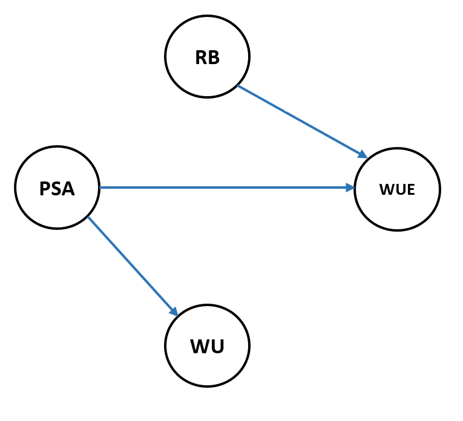
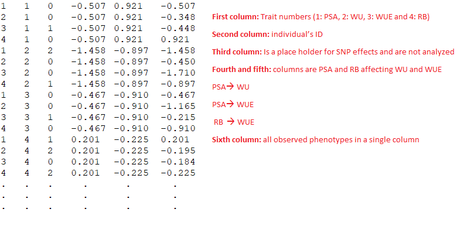
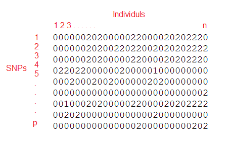
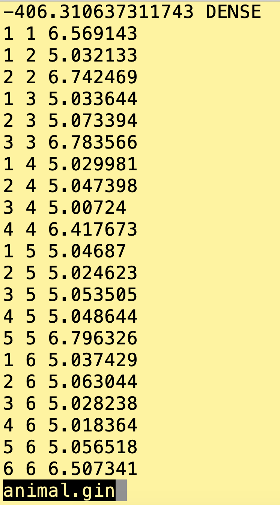
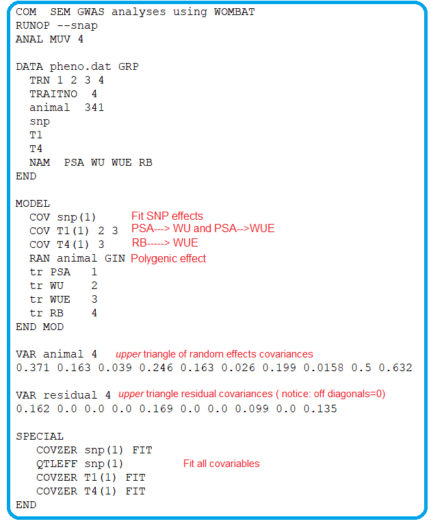

```{r setup, include=FALSE}
knitr::opts_chunk$set(echo = TRUE, warning = FALSE, message = FALSE)
```

## Introduction
Multiple trait analysis is common in a genome-wide association study (GWAS) by leveraging genetic correlations among phenotypes. While a multi-trait genome-wide association study (MTM-GWAS) is a powerful approach, it fails to distinguish the causal relationships among phenotypes. Use of a structural equation model allows us to incorporate trait network structures into the MTM-GWAS framework. This tutorial inllustrates the application of structural equation model GWAS (SEM-GWAS) using shoot biomass (PSA), root biomass (RB), water use (WU), and water use efficiency (WUE) in rice[@momen2019utilizing].

## SEM-GWAS modeling
In this tutorial, we will fit a single marker SEM-GWAS using [WOMBAT](http://didgeridoo.une.edu.au/km/wombat.php).
WOMBAT requires the followings: 1) a network structure between traits; 2) phenotype file; 3) marker genotype file; 4) relationship matrix (e.g., genomic relatinship matrix); and 5) WOMBAT parameter file.

### Network structure between traits
You can specify the network structure between traits by using  biological knowledge/prior or estimating from the data. We will assume the following network structure in this tutorial. 




### Phenotype file (Pheno.dat)
The phenotype file includes columns of trait number, individual ID, SNP marker, causal covariates (phenotypes), and phenotypic records. Genotypes are ordered within four traits (columns 1 , 2, and 6) and two causal covariates (i.e., PSA and RB) are included in columns 4 and 5. The third column is treated as a place holder, which is randomly sampled from a binomial distribution. 



### Genotype file (QTLAllels.dat)
The marker matrix is ordered as makers by individuals, and the file name need to be QTLAllels.dat. 



### Relationship matrix (animal.gin)
Only the upper triangular (including diagonal) elements will be needed in this file. The determinant (optional) of the relationship matrix is provided in the first row. 

{#id .class width=30% height=30%}

### Parameter file 
The parameter file of WOMBAT is shown below. In the second row, the option `--snap` [@meyer2012snp] is specified to fit a single marker GWAS. In the model section, the causal covariates (i.e., PSA and RB) are explicitly assigned to WU and WUE according to the trait network structure. Check this [page](http://didgeridoo.une.edu.au/womwiki/lib/exe/fetch.php?media=wombat:example14.pdf) for additional information. 



### Run SEM-GWAS using Wombat
`./wombat -cv --snap parameterfile.par`

## References


