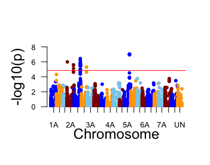

```{r setup, include=FALSE}
knitr::opts_chunk$set(echo = TRUE, warning = FALSE, message = FALSE)
```

## Introduction
This exercise illustrates how to perform variance heterogeneity genome-wide association study (vGWAS) using a double generalized linear model (DGLM). 


## Load R packages
```{r, eval=FALSE, echo=TRUE}
Packages <- c("dglm", "qqman")
# install.packages("dglm")
# install.packages("qqman")
lapply(Packages, library, character.only = TRUE)
```

## Read data
We will analyze grain cadmium concentration for 299 hard-red winter wheat accessions genotyped with 14,708 markers. You can download the data from [here](https://github.com/whussain2/vGWAS/tree/master/Data/Raw_data) and [here](https://github.com/whussain2/vGWAS/tree/master/Data/pca_data). See [Hussain et al. (2019)](https://doi.org/10.1101/668087) for details. 
```{r, eval=FALSE, echo=TRUE}
rm(list=ls())
# Read the cadmium genotypes
geno <- readRDS(file = "geno.rds")
# Read the cadmium phenotype
pheno_data <- readRDS(file = "pheno_ok2_final.rds")
# Read the principal components to account for population structure
covar <- readRDS("pca_hww_299.rds")
# Marker annotation
map <- readRDS("map_final.rds")
```

## Define a DGLM function
We first define a function that uses the `dglm` R package to fit a DGLM-based single-marker vGWAS model. 
```{r, eval=FALSE, echo=TRUE}
my.pdglm <- function(i, y, geno, covar) {
    model <- dglm(y ~ geno[, i] + covar[, 2] + covar[, 3] + covar[, 4] + covar[, 5], ~ geno[, i], family = gaussian(link = identity))
    P.mean <- summary(model)$coef[2, 4]  # Extarct p values for mean part
    P.disp <- anova(model)$Adj.P[2]  # Extract P values for dispersion part
    s.model <- summary(model$dispersion.fit)
    beta <- s.model$coef[2, 1]  # Extarct cofficients
    se <- s.model$coef[2, 2]  # Extract standard errors
    out <- data.frame(Beta = beta, SE = se, P.mean = P.mean, P.disp = P.disp, 
        stringsAsFactors = FALSE)  # Save all the extracted variables in data frame out
    return(out)
}
```


## Fit a DGLM 
Apply the DGLM function we defined above to the wheat data.  
```{r, eval=FALSE, echo=TRUE}
y <- pheno_data[,5]
TF <- matrix(NA, nrow = dim(geno)[2], ncol = 4)
  for (i in 1:dim(geno)[2]) {
  #for (i in 1:10) {
    try({
        outm <- my.pdglm(i = i, y = y, geno = geno, covar = covar)
        TF[i, ] <- as.numeric(outm)
        print(i)
    }, silent = TRUE)
}

colnames(TF) <- c("Beta", "SE", "P.mean", "P.disp")
head(TF)
TF2 <- data.frame(map, TF)
head(TF2)
```


## Manhattan plot
We create a Manhattan plot using the `qqman` R package. 
```{r, eval=FALSE, echo=TRUE}
TF2$chrom <- as.numeric(TF2$chrom)

manhattan(x = TF2, chr="chrom", bp="pos", p="P.disp", suggestiveline = FALSE, genomewideline = -log10(1.44e-05), chrlabs = c("1A", "1B", "1D", "2A", "2B", "2D", "3A", "3B", "3D", "4A", "4B", "4D", "5A", "5B", "5D", "6A", "6B", "6D", "7A", "7B", "7D", "UN"), col = c("blue", "orange", "skyblue", "darkred"), logp = TRUE, cex.lab = 1.5, ylim = c(0, 8), xlab = "Chromosome", ylab = "-log10(p)", cex.axis = 0.8, mgp = c(2, 1, 0))
```



We can observe that there are peaks on chromosomes 2A, 2B, and 5A. 
